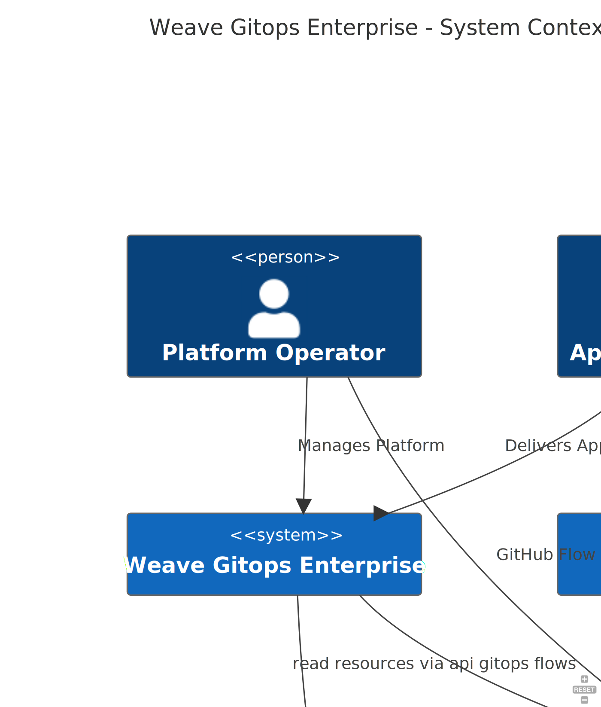
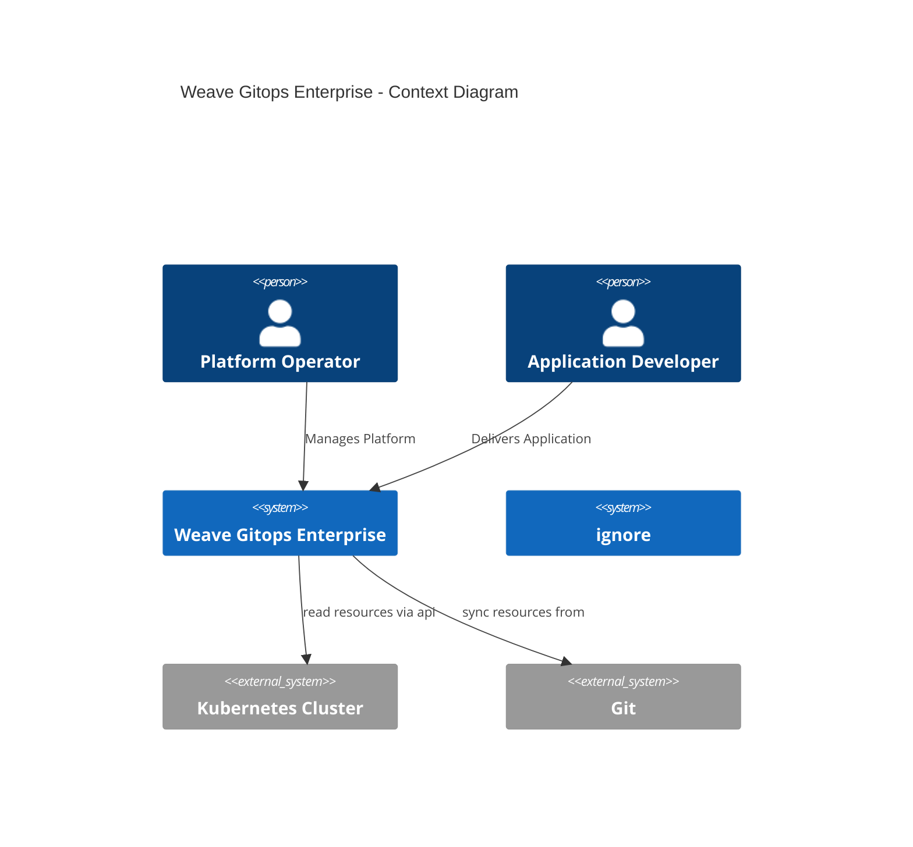
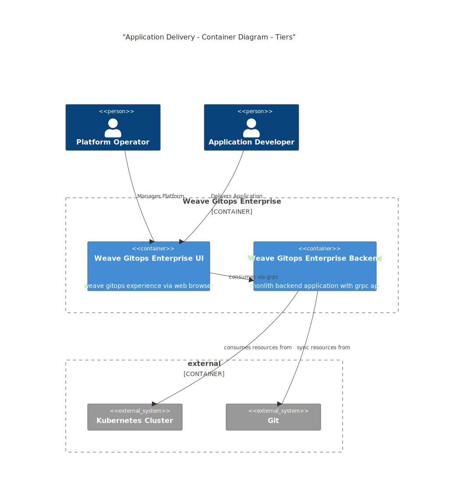
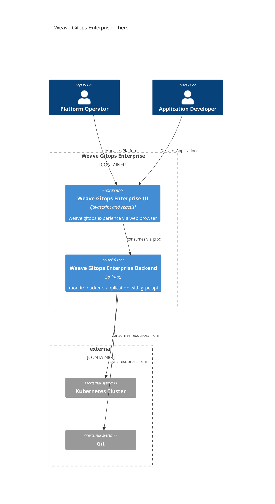
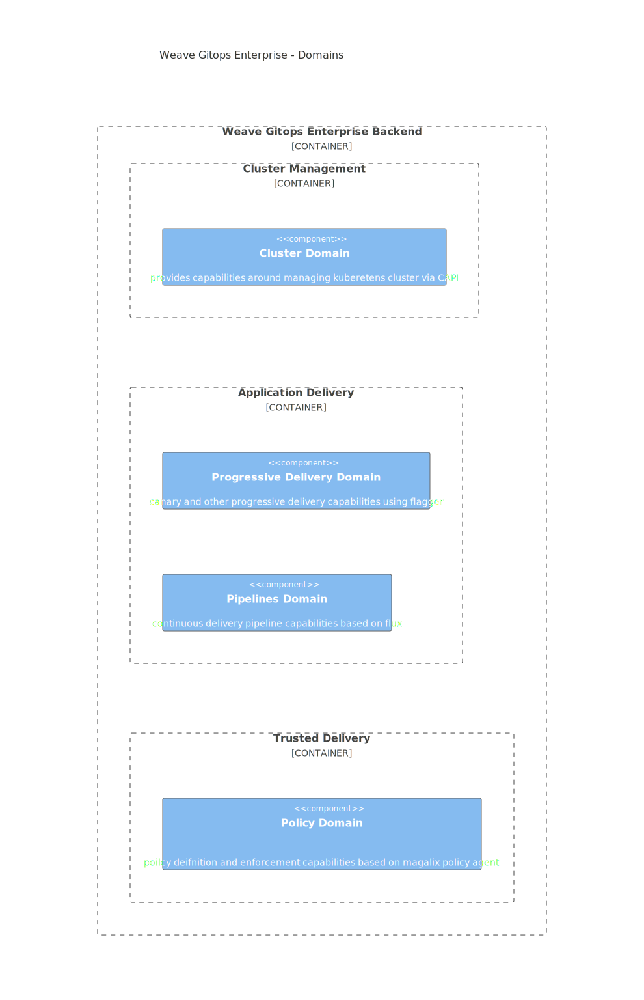
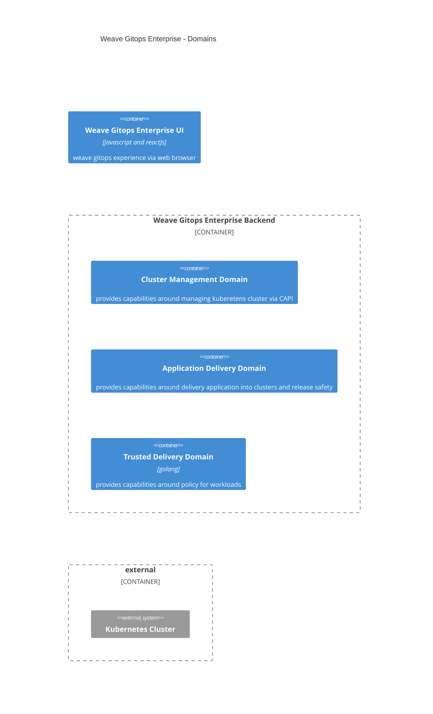

# Architecture Documentation

## Motivation and Audience
To make visible Weave Gitops Enterprise architecture. 

You would be interested on it 

2. You are working in a capability within the domain.
3. You are working in a capability in another domain that has a dependency with it.
4. You are not working in the context of the domain nor dependent, but want to understand a bit more
   of the wider weave gitops architecture.

## Glossary

TBA

## Weave Gitops Enterprise

### Assumptions

Diagrams aim to be self-explanatory but 

1. They are based on [C4 Model](https://c4model.com/). If you have problems understanding them please take some time 
to get familiar via skimming [abstractions](https://c4model.com/#Abstractions) and [notation](https://c4model.com/#Notation) 
or  [watch this](https://www.youtube.com/watch?v=x2-rSnhpw0g).
2. They are using concepts from Domain Driven Design. If it gets difficult to read, please have a look to 
the following [article](https://medium.com/@ruxijitianu/summary-of-the-domain-driven-design-concepts-9dd1a6f90091). 

### System Diagram 

### Tiers

Weave Gitops Enterprise as tiered application that could be seen in the following diagram

Looking into application delivery domain capabilities we could see the following

### Business Domains 

Looking into application delivery domain capabilities we could see the following

Business Domains 

- [Cluster Management](cluster-management.md)
- [Application Delivery](application-delivery.md) 
- [Trusted Delivery](trusted-delivery.md)
