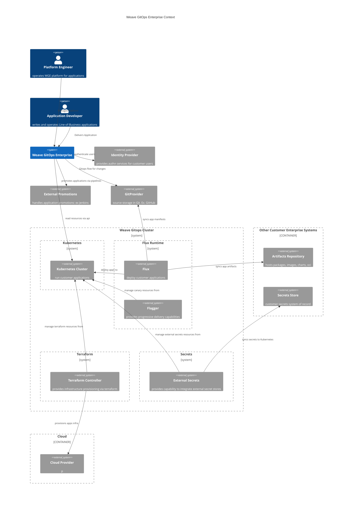
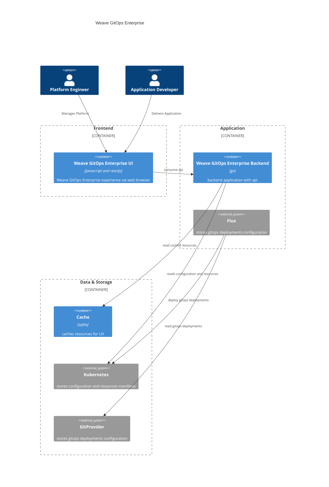
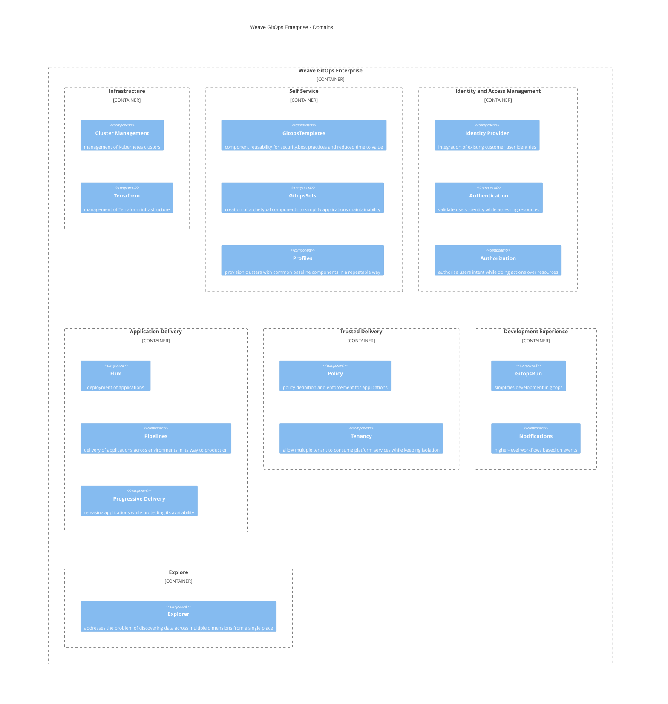

# Architecture Documentation

## Motivation

This documentation tries to make the Weave GitOps Enterprise architecture visible in a simple way.

You would benefit of this documentation if you are in any of the following journeys.

1. I want to understand how Weave GitOps Enterprise looks as a system in a simple way.
2. I want to understand the high level building blocks or component within Weave GitOps Enterprise in a simple way.
3. I want to understand the different business domains served by Weave GitOps Enterprise in a simple way.
4. For any of the domains, I want to go deeper in terms of behaviour, api or code in.

## Assumptions and Limitations

Diagrams aim to be self-explanatory however:

1. They are based on [C4 Model](https://c4model.com/). If you have problems understanding them please take some time
   to get familiar via skimming [abstractions](https://c4model.com/#Abstractions) and [notation](https://c4model.com/#Notation)
   or [watch this](https://www.youtube.com/watch?v=x2-rSnhpw0g).
2. They are using concepts from Domain Driven Design. If it gets difficult to read, please have a look to
   the following [article](https://medium.com/@ruxijitianu/summary-of-the-domain-driven-design-concepts-9dd1a6f90091).
3. We are using [mermaid](https://mermaid-js.github.io/mermaid/#/) for diagramming. It currently has support
   for [C4](https://mermaid.js.org/syntax/c4c.html) in early stage with limitations on editing experience or features.

## Getting Started

It depends on your expected outcome. This section assumes that you are an engineering within Weave Gitops and you are onboarding
to the product within a particular business domain. We suggest you use this documentation as part of the onboarding to get started:

1. Head to [Weave Gitops System](#system) as it provides you a high-level understanding on who are the users and Weave Gitops Dependencies.
2. Review [Weave Gitops Tiers](#tiers) as it provides with the layering of the application and access to the codebase by tier.
3. View the [Weave Gitops Domain](#domains) to provide you a high level overview of the problem spaces that Weave Gitops faces.
4. Select the domain that you would be contributing to. Understand the solution space via
   - its diagram and user flows,
   - follow the tiers approach UI -> API -> Backend,
   - access the codebase.

This outside-in approach should provide you some structure when you face your first ticket.

## Glossary

Here there are few definitions that might help you to get along the documentation:

- **Domain:** A domain or business domain defines the problem space that you are interested to address for your users. For example, an infrastructure business domain addresses the problem of providing the infrastructure layer that developers would need for their applications.
- **Sub-Domain:** a problem space within a domain. For example, cluster provisioning is a subdomain within the infrastructure domain, so it addresses the problem of providing the infrastructure layer for running containerised apps.

## Overview

Weave GitOps Enterprise is an enterprise application made of a

- management web application, deployed in a management Kubernetes cluster and
- a set of Kubernetes controllers and operators for executing different workflows.

### Management Console

It is a tiered web application with the following main characteristics:

**Frontend**: [Weave GitOps Enterprise UI](https://github.com/weaveworks/weave-gitops-enterprise/tree/main/ui) is the web interface
that provides the experience layer to the users. It is built in [react](https://react.dev/) and uses [yarn](https://react.dev/) as the package manager.

More info about this tier [here](#frontend-or-experience-layer).

**API**: provides the integration layer for creating applications based in Weave GitOps Enterprise domain capabilities. It is defined mainly as [protobuf](https://protobuf.dev/)
and automatically converted to [openapi](https://swagger.io/specification/). It is served as http/json and converted to grpc
via [grpc-gateway](https://github.com/grpc-ecosystem/grpc-gateway).

More info about this tier [here](#api).

**Application or Backend**: this layer provides the server and business logic for Weave GitOps Enterprise. It is built in [Go](https://go.dev/)
using its latest version [1.20](https://tip.golang.org/doc/go1.20).

More info about this tier [here](#application).

**Data and Storage**: Weave GitOps Enterprise uses Git as its primary storage. It uses the Kubernetes API for other resources
like configmaps for Weave GitOps Enterprise application configuration. It also uses caching based on [SQLite](https://sqlite.org/index.html)
for improving application UX and responsiveness.

More info about this tier [here](#data-and-storage).

**Git Providers**: Weave GitOps Enterprise supports Gitops workflows in the major Git providers: [GitHub](https://github.com/),
[GitLab](https://about.gitlab.com/), [Bitbucket](https://bitbucket.org/product) or [Azure Devops](https://azure.microsoft.com/en-us/products/devops/).

**Authentication**: any user or machine request flowing in Weave GitOps Enterprise is authenticated.
User authentication is done via [OIDC](https://auth0.com/docs/authenticate/protocols/openid-connect-protocol).
[JWT tokens](https://jwt.io/) are then used for auth then used for user authentication in the
[Weave GitOps Enterprise UI](https://docs.gitops.weave.works/docs/configuration/oidc-access/) and
in [Kuberentes](https://kubernetes.io/docs/reference/access-authn-authz/authentication/#openid-connect-tokens).

**Authorization**: any user or machine request flowing in Weave GitOps Enterprise is authorised. Weave GitOps Enterprise leverages authorization
to [Kubernetes RBAC](https://kubernetes.io/docs/reference/access-authn-authz/rbac/).

More info about authentication and authorization in [IAM](./iam.md)

**Deployment**: Weave GitOps Enterprise is packaged and delivered via [helm charts](https://helm.sh/).

### Kubernetes Controllers

To extend Weave GitOps Enterprise the following services, controllers and operators are integrated:

From Weaveworks, Weave GitOps Enterprise integrates:

- [Flux](https://fluxcd.io/) is the core component for delivery gitops applications.
- [Flagger](https://flagger.app/) is the component within the Flux Ecosystem for providing advance deployment strategies or progressive delivery.
- [Terraform Controller](https://docs.gitops.weave.works/docs/terraform/overview/) is the controller that provides capabilities to manage terraform infrastructure within WGE.
- [Cluster Controller](https://github.com/weaveworks/cluster-controller): provides the capability to integrate Kubernetes clusters for Weave GitOps Enterprise.
- [Cluster Bootstrap Controller](https://github.com/weaveworks/cluster-bootstrap-controller): responsible for bootstrapping Kubernetes clusters joining Weave GitOps Enterprise with baseline capabilities like flux.
- [GitopsSet Controller](https://github.com/weaveworks/gitopssets-controller): provides the capability to have a single definition for an application for multiple environments and a fleet of clusters.
- [Pipeline Controller](https://github.com/weaveworks/pipeline-controller): provides continuous delivery pipelines capabilities for Weave GitOps Enterprise.
- [Policy Agent](https://github.com/weaveworks/policy-agent): controller to enforces [rego policies](https://www.openpolicyagent.org/docs/latest/policy-language/) by controlling admission of violating resources.

These controllers are built in Go following Kubernetes industry-standard approach based on [kubebuilder](https://github.com/kubernetes-sigs/kubebuilder)
and [controller runtime](https://github.com/kubernetes-sigs/controller-runtime)

From wider cloud-native ecosystem, Weave GitOps Enterprise integrates:

- [External Secrets](https://external-secrets.io/) is the system that provides the capability to integrate external secret stores within WGE.

More info about each of them could be found within their domain. See [domains view](#domains).

### Scalability, High Availability and Disaster Recovery 

#### Weave Gitops Enterprise Management Console

In terms of scalability Weave Gitops Enterprise Management Console presents the following features:

- It uses golang's HTTP infrastructure which handles concurrent connections efficiently, so API server instances scale well vertically
- In terms of scalability models, Weave GitOps Enterprise management app could scale vertically to simplify operations, or 
it could also do it horizontally as:
  - User sessions are self-contained in cookies that comes in each user request.
  - We don't hold application state, but we serve it from Kubernetes. 
  - Our data layer is cache layer with read-only capabilities that lives alongside each of the server instances.
- High Availability can be achieved by having multiple API server instanced behind a load balancer with sticky sessions enabled.
- Disaster Recovery for the app, as the state is hold in Kubernetes, follows the same approach as any other stateless application and
  to be determined by the DR strategy of the team running the platform running Weave Gitops Enterprise.

#### Kubernetes Controllers

About the Kubernetes controllers the following statements are true: 

- They use controller-runtime, which makes it convenient to scale by increasing the number of concurrent workers
- Given the reconcile resources that usually require write operation or mutating state, they are generally vertically scalable except Flux that supports [horizontal scaling](https://fluxcd.io/flux/installation/configuration/sharding/) 
- These controllers are built in Go following Kubernetes industry-standard approach based on [kubebuilder](https://github.com/kubernetes-sigs/kubebuilder)
  and [controller runtime,](https://github.com/kubernetes-sigs/controller-runtime) so they could achieve HA via multiple instances with enabled [leader-election](https://pkg.go.dev/github.com/kubernetes-sigs/controller-runtime/pkg/leaderelection). 
- Disaster Recovery for controllers, as the state is hold in kubernetes, follows the same approach as any other stateless application and 
to be determined by the DR strategy of the team running the platform running Weave Gitops Enterprise.

## Weave GitOps Enterprise

### Views

This outer layer provides a look to Weave GitOps Enterprise (wge) in three views:

1. As a [System](#system) including its wider context and external dependencies.
2. As [Tiers](#tiers) that provides a high level overview of the application tiers.
3. As [Domains](#domains) to provide an overview of the problem spaces that WGE addresses.

### System

Weave GitOps Enterprise (WGE) as a system, provides management capabilities, for Platform Engineers and Applications Developers,
in the context of delivering and operating gitops applications based on Flux across Kubernetes clusters:

As mentioned, there are two main personas to serve:

- Platform Engineers who are in charge of admin and operate the platform.
- Application Developers that deliver business application within the platform.

WGE sits on top or integrate a set of external systems for gitops delivery and runtime:

- [Kubernetes](https://kubernetes.io/) clusters are the core component for running applications.
- [Flux](https://fluxcd.io/) is the core component for delivery gitops applications.
- [Flagger](https://flagger.app/) is the component within the Flux Ecosystem for providing advance deployment strategies or progressive delivery.
- [GitProviders](https://docs.gitops.weave.works/docs/installation/weave-gitops-enterprise) hosts the git repositories
  that hosts any gitops configuration manifest.Serves as sources of truth. Examples are GitHub or GitLab.
- [Identity Provider](https://docs.gitops.weave.works/docs/configuration/oidc-access/): provides identity services for Weave GitOps Enterprise to integrate in the context of user authentication and authorization.
  Examples of identity providers could be Google or Okta.
- [External Secrets](https://external-secrets.io/) is the system that provides the capability to integrate external secret stores within WGE.
- [Terraform Controller](https://docs.gitops.weave.works/docs/terraform/overview/) is the system that provides capabilities to manage terraform infrastructure within WGE.

The following diagram represents the system as a whole. The following considerations might be useful to be fully 
understand the diagram:
- Weave Gitops Cluster is represented once for simplicity but in reality is presented as:   
  - Weave Gitops Management Cluster: single instance that holds the management console and control plane controllers.
  - Weave Gitops Leaf Cluster: multiple instances that run business applications and managed by Weave Gitops Management Cluster.
  
- In terms of **data-flows**, the line starts by the source entity starting the connection and commonly starting a request. For example, 
Weave Gitops Enterprise opens connections to a Git Provider api for example to request creating a Pull Request.
- In terms of **networks**, we could say that:
    - Weave Gitops Cluster:
      - All components from a cluster lives in the same kubernetes cluster so under the same kubernetes control plane that would be commonly
          deployed in the same network (for example in a VPC). 
      - Communication between Weave Gitops Management and Weave Gitops Leaf clusters happens via Kubernetes API so needs to be accessible.
      - Platform Engineers or Developers consumes the app via a web browser that would communicate with the API server via either public or private networks depending on the customer deployment.
    - External Systems outside Management or Leaf could communicate via public or private network depending on the customer needs and requirements. 
    For example, it could communicate with GitHub via internet if using the hosted version, or via internal network if using GitHub Enterprise self-hosted.



 

### Tiers

Weave GitOps Enterprise could be also viewed as a three-tier architecture where:

#### Frontend

[Weave GitOps Enterprise UI](https://github.com/weaveworks/weave-gitops-enterprise/tree/main/ui) is the web interface
that provides the experience layer to the users. It is built in [React](https://react.dev/) and uses [yarn](https://react.dev/) as the package manager.

As experience layer is oriented to end user in order to enable Platform Engineers or Developers to achieve their workflows.
These workflows are delivered through [components](../../ui/src/components) that mostly falls into the following categories:

1. To view and filter a collection of resources that spans multiple Kubernetes clusters. it also aims to have summary single pane
   of glass by resources. Example could be [Cluster List](../../ui/src/components/Clusters/ClustersList.tsx)
2. Once determined the resource context, to drill down in the resources via its detail view. This details view
   contains not only the desired state but also its reconciled or runtime state, in addition to general and specific
   management operations. An example could be [ClusterDetails.tsx](../../ui/src/components/Clusters/ClusterDetails.tsx)
3. Add operations for any resource, via gitops flow. For example [Add Application](../../ui/src/components/Applications/Add/index.tsx)
4. Other management operations specific for the resource. For example for pipelines, exercise a promotion [PromotePipeline.tsx](../../ui/src/components/Pipelines/PipelineDetails/PromotePipeline.tsx)

The pattern to execute those workflows are the same:

1. There is a React component modeling the interface to the user for showing data and gathering input.
2. The data is gathered from the backend via [api clients](../../ui/src/api) automatically generated
   from their protobuf [definitions](../../api)

#### Api

As mentioned in the previous section, the API layer provides the integration layer for creating experience applications
on top of Weave GitOps Enterprise domains, as well, as to enable other type of integrations, for example integration with other systems.

The primary API definitions are [protobuf](https://github.com/weaveworks/weave-gitops/blob/main/doc/adr/0002-api-definitions-grpc.md) and defined [here](../../api).
The API it is

- defined as [grpc](https://github.com/weaveworks/weave-gitops-enterprise/blob/main/api/gitopssets/gitopssets.proto)
- consumed as [rest/json](https://github.com/weaveworks/weave-gitops-enterprise/blob/main/api/gitopssets/gitopssets.swagger.json) from the UI
- converted http/json to grpc via [grpc-gateway](https://github.com/grpc-ecosystem/grpc-gateway).

#### Application

Weave GitOps Enterprise application layer or backend, it is an api server developed in Go built around its
domain entities and API definition.

Given so, a good way to understand the chain of responsibility is through the flow of an API request:

1. the experience layer sends a request to the backend endpoint for example "GET /v1/pipelines" to retrieve the pipeline collection
2. the request is being received by the backend server that goes through a set of filter or middleware.
3. One of those filters is authentication of the request that could be seen in [authentication](iam.md#authentication)
4. The request is being then handled by the api endpoint handler, in our example [list.go](../../pkg/pipelines/server/list.go)
   that usually:
   - Requests the resource to its cluster via Kubernetes API, in this case, a Pipeline resource to the Management cluster,
   - Aggregates and process the data
   - Returns the result set to the api client

The backend application is a modular application based on aggregation of domain-specific servers:

1. Clusters service [server.go](../../cmd/clusters-service/app/server.go) provides that aggregation layer for
   the domain-specific servers (as well as service its specific domain).
2. Domain-specific server are self-contained within their package for example [pipelines](../../pkg/pipelines) contains
   the [pipelines server](../../pkg/pipelines/server/server.go).
3. The server integration is controlled via feature flagging like:
   ```go
   if featureflags.Get("WEAVE_GITOPS_FEATURE_PIPELINES") != "" {
       if err := pipelines.Hydrate(ctx, grpcMux, pipelines.ServerOpts{}); err != nil {
           return fmt.Errorf("hydrating pipelines server: %w", err)
       }
   }
   ```

#### Data and Storage

In terms of data and storage:

- Weave GitOps Enterprise uses Git as its primary storage.
- It also uses the Kubernetes API for other resources like configmaps for Weave GitOps Enterprise application configuration.
- It also uses caching based on [SQLite](https://sqlite.org/index.html) for improving application UX and responsiveness:
  - Search engine [store.go](../../pkg/query/store/store.go)
  - Helm chart [indexer.go](../../pkg/helm/helm_chart_indexer.go)

The previous layers are seen in the following diagram



### Domains

There is another high-level architectural view to understand Weave GitOps Enterprise: the problem spaces it faces or
business domains and its intersection with GitOps. The following diagram presents them altogether:



To these problems, WGE provides solutions for. The next section goes into each of the domains.

#### Infrastructure

Our users require both infrastructure to run applications and the applications itself requires infrastructure services like
data stores for example. Infrastructure domain addresses both of the problems:

1. Provides a general purpose approach to provision and manage Kuberentes clusters.
2. Provides a general infrastructure management solution based on Terraform to allow application temas to self-service their infrastructure needs.

Subdomains:

- Cluster Management: to manage Kubernetes clusters within WGE.
- Terraform: to manage infrastructure via Terraform within WGE.

For a deeper look into the domain [Infrastructure](infrastructure.md)

#### Self-service

Our users want to streamline the process of getting started while reusing organisational knowledge and ensuring
alignment with organisational standards. Self-service domains focuses in this problem space by the following subdomains:

- GitopsTemplates: how to create reusable components in order to enable best practices or reduce time to value for platform or application teams.
- GitopsSets: how to create archetypal components that simplifies maintainability of applications in a complex a dynamic platform.
- Profiles: how to bootstrap clusters with baseline components in a repeatable way.

For a deeper look into the domain [Self Service](self-service.md)

#### Trusted Delivery

While we want to empower developers and DevOps teams to build better software faster through
we also want them to be able to do it confidently. Moving fast often means risking quality and security,
and counting on humans to spot problems is often error-prone and is not scalable.
Trusted Delivery covers this part of the value we're trying to deliver to our customers.

Subdomains:

- Policy: policy definition and enforcement for applications.
- Tenancy: allow multiple tenant to consume platform services while keeping isolation.

For a deeper look into the domain [Trusted Delivery](trusted-delivery.md)

#### Application Delivery

Organisations provide value to customer through business capabilities, those business
capabilities are created in the form of applications that needs to be managed and delivered to customers.

Subdomains:

- Progressive Delivery: how to release applications to environments protecting application availability.
- Pipelines: deploying software across a set of stages (a pipeline), each becoming more production-like. This is usually done in an automated fashion, but not exclusively.
- Flux: how to deploy gitops applications to Kubernetes clusters.

For a deeper look into the domain [Application Delivery](application-delivery.md)

#### Development Experience:

Development within gitops represents different challenges to traditional software development.
To reduce the adoption barriers is the problem to solve within this domain.

Subdomains:

- GitopsRun: to remove the complexity for developers so that Platform Engineers can create developer environments easily,
  and Developers can benefit from GitOps and focus on writing code.
- Notifications: to broadcast and ingest events that enables higher-level workflows.

For a deeper look into the domain [Development Experience](devex.md)

#### Identity and Access Management

Users want to use their existing (or new) identities to consume services and to establish access control to them. The following
subdomains are part of it:

- Authentication: identifies an anonymous user within the platform.
- Authorization: validate users identity while accessing resources.
- Identity Providers Integration: address the problem of integrating existing identity providers within Weave GitOps Enterprise keeping their identities.

For a deeper look into the domain [IAM](iam.md)

#### Explore

Modern applications and infrastructure presents challenges to discover and aggregate data coming from different sources.
Explore domain addresses this problem space to provide users a single and simple way.

- Explorer: is the capability that allows searching across multiple infrastructure domains in a single place.

For a deeper look into the domain [Explore](explore.md)
