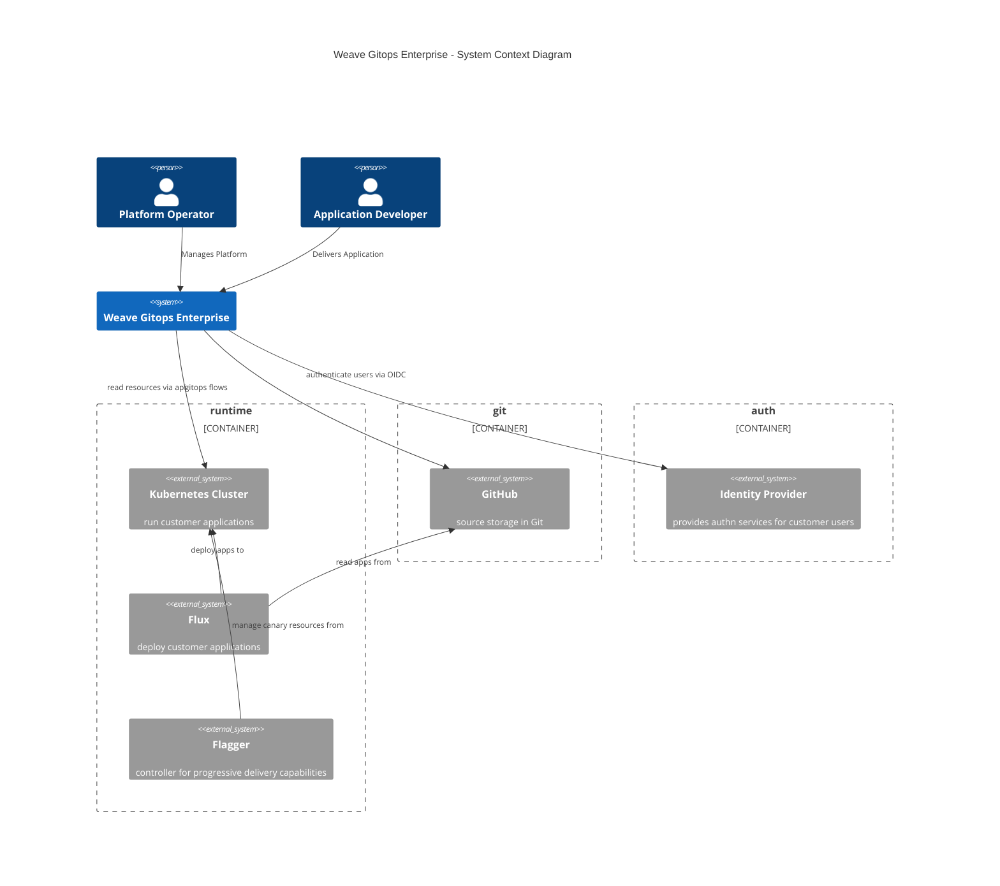
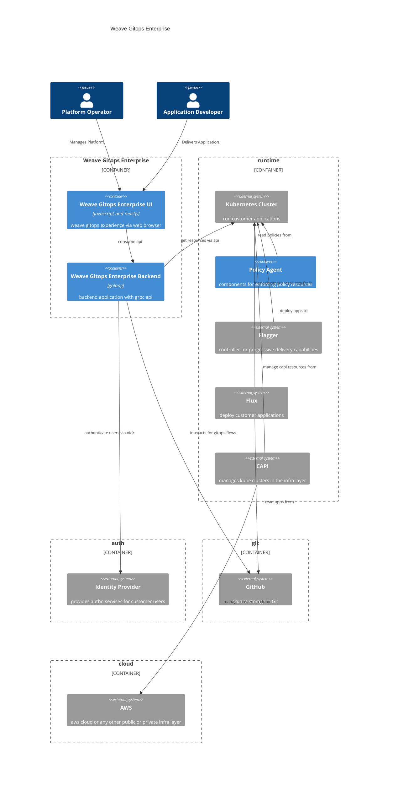
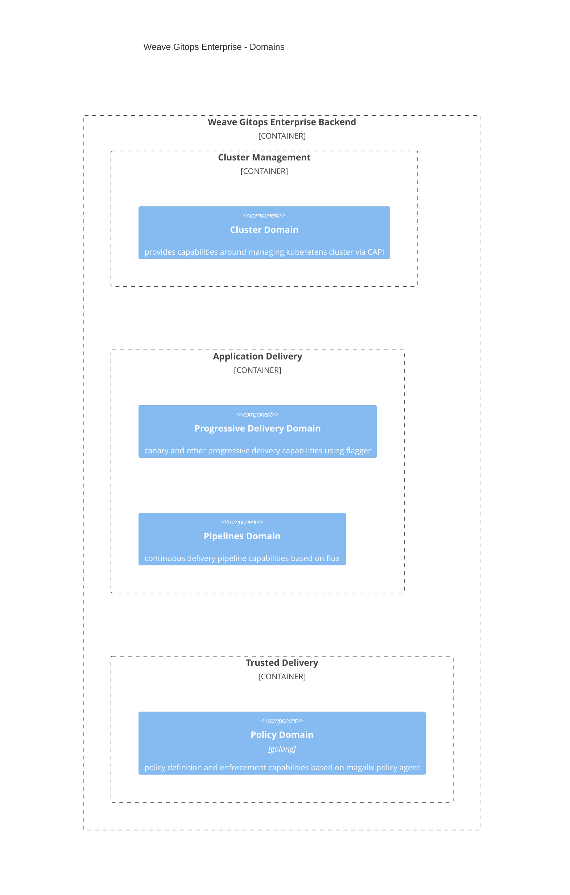

# Architecture Documentation

## Motivation

This documentation tries to make visible Weave Gitops Enterprise architecture in a simple way. 

You would benefit of this documentation is you are in any of the following journeys.

1. I want to understand how Weave Gitops Enterprise looks as a system in a simple way.
2. I want to understand the high level building blocks or component within Weave Gitops Enterprise in a simple way. 
3. I want to understand the different business domains served by Weave Gitops Enterprise in a simple way.
4. For any of the domains, I want to go deeper in terms of behaviour, api or code in. 

## Assumptions and Limitations

Diagrams aim to be self-explanatory however:

1. They are based on [C4 Model](https://c4model.com/). If you have problems understanding them please take some time
   to get familiar via skimming [abstractions](https://c4model.com/#Abstractions) and [notation](https://c4model.com/#Notation)
   or  [watch this](https://www.youtube.com/watch?v=x2-rSnhpw0g).
2. They are using concepts from Domain Driven Design. If it gets difficult to read, please have a look to
   the following [article](https://medium.com/@ruxijitianu/summary-of-the-domain-driven-design-concepts-9dd1a6f90091).
3. We are using [mermaid](https://mermaid-js.github.io/mermaid/#/) for diagramming. It currently has support 
   for [C4](https://mermaid.js.org/syntax/c4c.html) in early stage with limitations on editing experience or features. 

## Weave Gitops Enterprise

This outer layer provides a look to Weave Gitops Enterprise (wge) in three views:

1. As a System including its wider context and external dependencies.
2. As Tiers that provides a high level overview of the application tiers. 
3. As Domains to provide an overview of the problem spaces that WGE addresses. 

### System

It aims to represent Weave Gitops Enterprise as a whole system and how it fits into the world around it.

### Tiers

Weave Gitops Enterprise as tiered application that could be seen in the following diagram

### Domains

From the previous view, we could go a level deeper to understand the different business domains that weave gitops enterprise.

Extend understanding on any of the domain by going into their page 

- [Cluster Management](cluster-management.md)
- [Application Delivery](application-delivery.md) 
- [Trusted Delivery](trusted-delivery.md)
