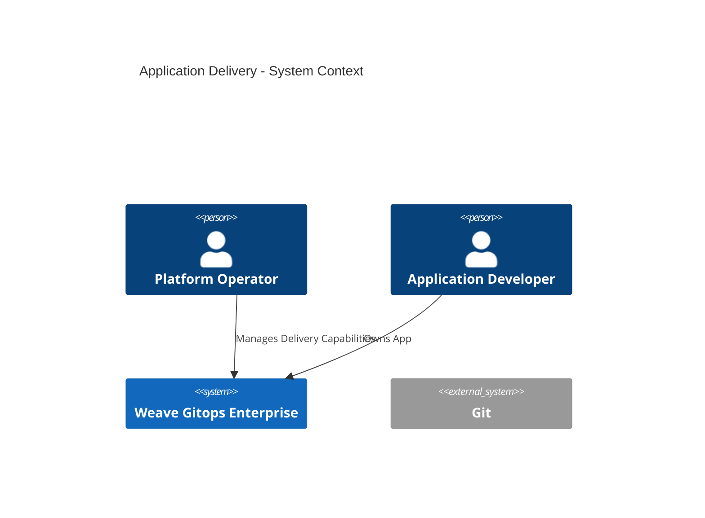
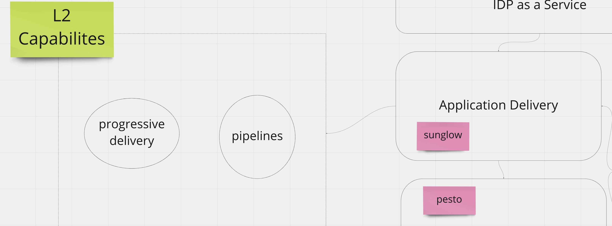
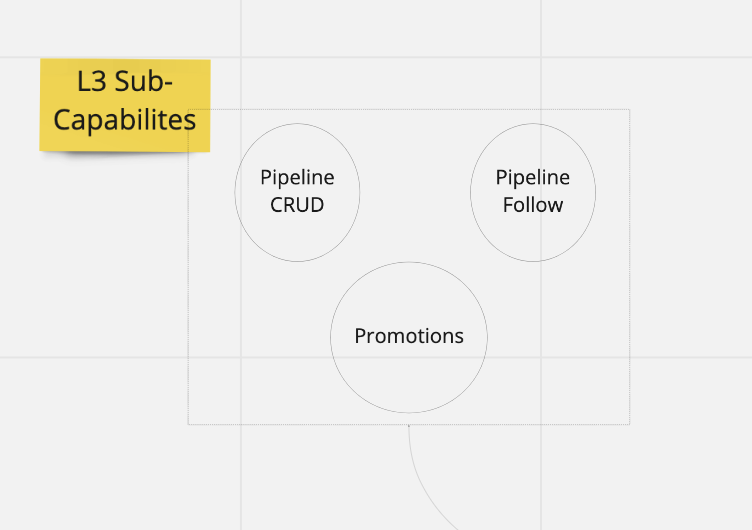
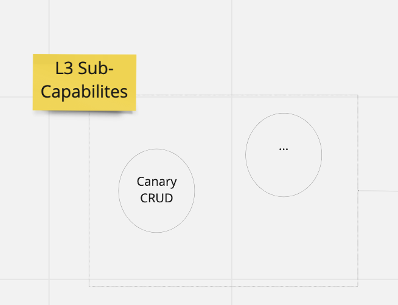

# Application Delivery 

This document outlines an architecture documentation for Weave Gitops Application Delivery domain.

## Motivation

As software business, value is delivered to the users or customers by enabling them to do actions. 
That enablement of the user is rarely a thing that happens statically but evolves over time. 

In software, as the enablement of the user comes through software components, the evolution of that enablement 
involves evolution of the underlying software components. Traditionally called in several ways, application, services ,etc ..

As [our mission](https://www.weave.works/company/) states
> to empower developers and DevOps teams to build better software faster. 

We require to provide capabilities to enable evolution of the software. Application Delivery enables that part of our
business domain.

## Application Delivery Domain

Application Delivery represent the business domain for all capabilities that enables a weave gitops user to deliver application changes.

- Pipelines: enables a user to deliver application changes across different environment in an orchestrated manner. 
- Progressive Delivery: enables a user to deliver an application change into a given environment in a safe manner to optimise for application availability.

### Pipelines Capability

Pipelines enables a user to deliver application changes across different environment in an orchestrated manner.

It is composed by the following sub-capabilities

- pipeline: ability to define pipelines, environments and associations with applications. 
- pipeline status: ability to follow an application change along the environments defined in a pipeline specification.
- promotions: ability to define behaviour to apply after an application change has been deployed to an environment.

//TODO: move me to master
Its api could be found [here](https://github.com/weaveworks/weave-gitops-enterprise/blob/af0da2a895d205d837d1c7afaf29977225e01957/api/pipelines/pipelines.proto)

Next Steps:
- [code](https://github.com/weaveworks/weave-gitops-enterprise)
- [user documentation](https://docs.gitops.weave.works/docs/enterprise/intro/index.html)

Capability could be seen in action via:
- In development

#### Progressive Delivery Capability

Progressive Delivery enables a user to deliver an application change into a given environment in a safe manner to optimise for application availability.

It is composed by the following sub-capabilities

- canaries: allows to interact with flagger [canaries](https://docs.flagger.app/usage/how-it-works#canary-resource)
- metrics templates: allow to interact with flagger [metric templates](https://docs.flagger.app/usage/metrics#custom-metrics)

Its api could be seen [here](https://github.com/weaveworks/progressive-delivery/blob/main/api/prog/prog.proto)

Next Steps:
- [progressive delivery repo](https://github.com/weaveworks/progressive-delivery)
- [weave gitops enterprise](https://github.com/weaveworks/weave-gitops-enterprise)
- [user documentation](https://docs.gitops.weave.works/docs/guides/delivery/0)

This capability is available in weave gitops enterprise and could be seen in 
action in our [demo environments](https://demo-01.wge.dev.weave.works/applications/delivery)

