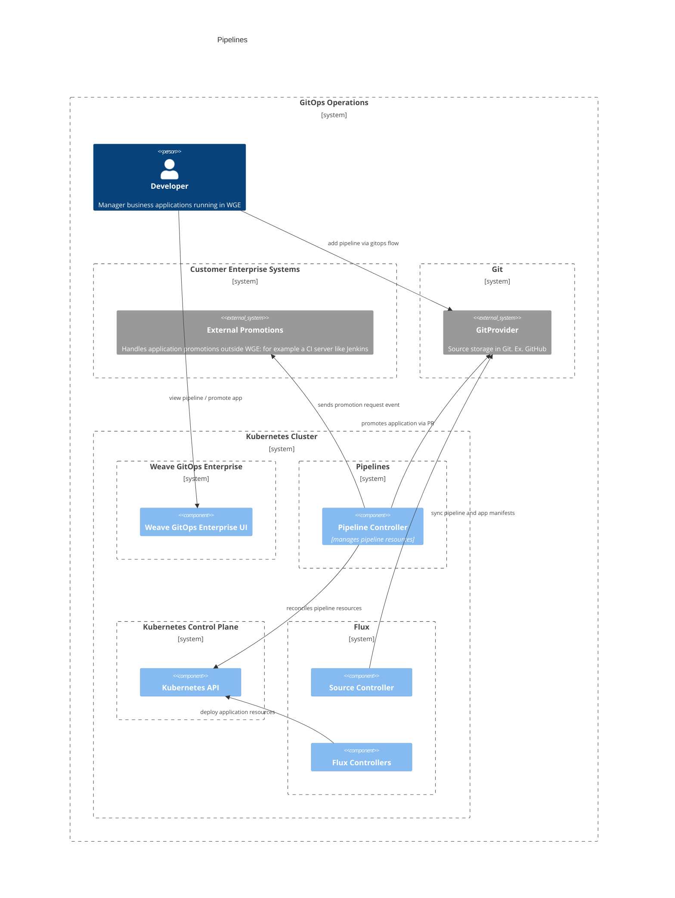
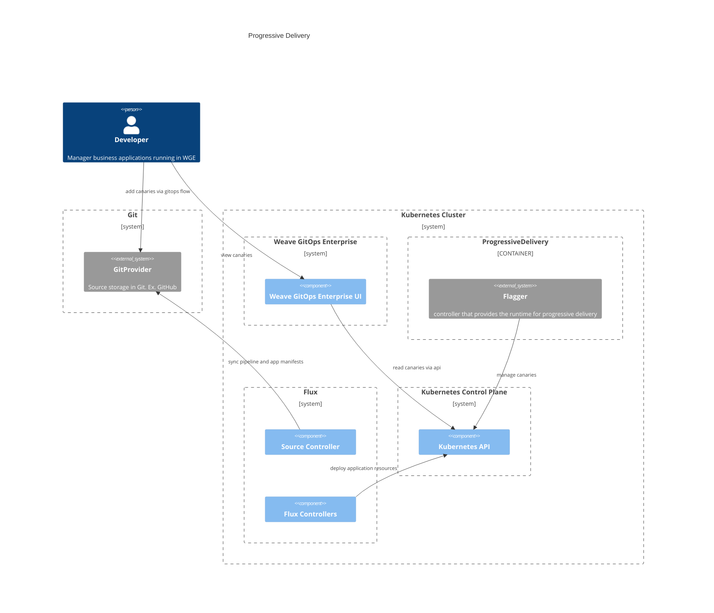

# Application Delivery 
This document outlines an architecture documentation for Weave GitOps Application Delivery domain.

## Motivation
As software business, value is delivered to the users or customers by enabling them to do actions.
That enablement of the user is rarely a thing that happens statically but evolves over time.

In software, as the enablement of the user comes through software components, the evolution of that enablement
involves evolution of the underlying software components. Traditionally called in several ways, application, services ,etc ..

As [our mission](https://www.weave.works/company/) states
> to empower developers and DevOps teams to build better software faster.

We require to provide capabilities to enable evolution of the software. Application Delivery enables that part of our
business domain.

## Glossary

- Pipelines
- Progressive Delivery

## Pipelines

Pipelines enables a user to deliver application changes across different environment in an orchestrated manner.

There are three main pipeline journeys:

1. As developer, to add a pipeline for my application, which is a regular gitops flow [Pipeline](https://docs.gitops.weave.works/docs/pipelines/spec/v1alpha1/pipeline/) 
2. As developer to view my application pipelines via [Weave GitOps UI](https://docs.gitops.weave.works/docs/pipelines/getting-started/)  
3. As developer to promote my application along the pipeline stages via [Weave GitOps UI](https://docs.gitops.weave.works/docs/pipelines/promoting-applications/) 

- Pipeline: ability to define deployment pipelines for applications that you could follow across environments.  

**In Action**
- Available via Weave GitOps Enterprise [pipelines](https://demo-01.wge.dev.weave.works/pipelines)

**Documentation and Next Steps**

- [API](https://github.com/weaveworks/weave-gitops-enterprise/blob/main/api/pipelines/pipelines.proto)
- [WGE Code](https://github.com/weaveworks/weave-gitops-enterprise/tree/main/pkg/pipelines)
- [Pipeline Controller Code](https://github.com/weaveworks/pipeline-controller)
- [User Documentation](https://docs.gitops.weave.works/docs/pipelines/intro/)

### Progressive Delivery

Progressive Delivery enables a user to deliver an application change into a given environment in a safe manner to optimise for application availability.

It is composed by the following aggregates or capabilities

- Canary: allows to read flagger [canaries](https://docs.flagger.app/usage/how-it-works#canary-resource).
- Metric Template: allow to read flagger [metric templates](https://docs.flagger.app/usage/metrics#custom-metrics).

**In Action**
- Available via Weave GitOps Enterprise [delivery experience](https://demo-01.wge.dev.weave.works/applications/delivery)

**Documentation and Next Steps**
- [API](https://github.com/weaveworks/progressive-delivery/blob/main/api/prog/prog.proto)
- [Progressive delivery repo](https://github.com/weaveworks/progressive-delivery)
- [Weave GitOps Enterprise](https://github.com/weaveworks/weave-gitops-enterprise)
- [User documentation](https://docs.gitops.weave.works/docs/guides/delivery/)

