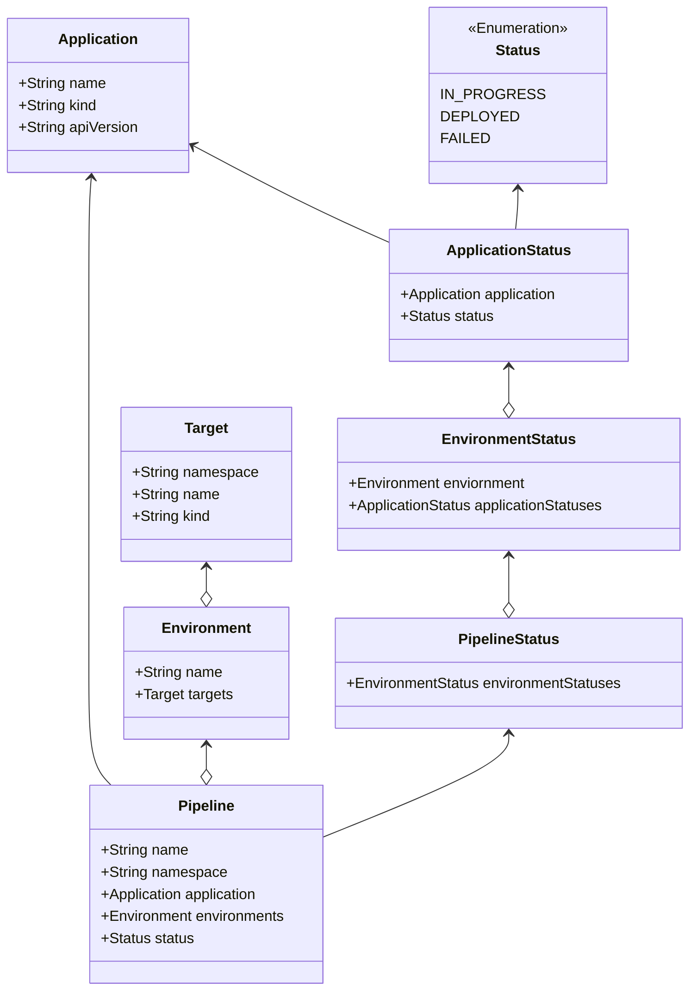

# Pipelines 

Source https://github.com/weaveworks/weave-gitops-enterprise/blob/main/api/pipelines/pipelines.proto 

## Domain Model

```mermaid
classDiagram 
    
    class Pipeline
        Pipeline : +String name
        Pipeline : +String namespace
        Pipeline : +Application application
        Pipeline : +Environment environments
        Pipeline : +Status status
    Application <-- Pipeline
    Environment <--o Pipeline
    PipelineStatus <-- Pipeline

    class Application
        Application : +String name
        Application : +String kind
        Application : +String apiVersion
    
    class Environment
        Environment : +String name
        Environment : +Target targets
    Target <--o Environment

    class Target
        Target : +String namespace
        Target : +String name
        Target : +String kind

    class PipelineStatus
        PipelineStatus : +EnvironmentStatus environmentStatuses
    EnvironmentStatus <--o PipelineStatus

    class EnvironmentStatus
        EnvironmentStatus : +Environment enviornment
        EnvironmentStatus : +ApplicationStatus applicationStatuses
    ApplicationStatus <--o EnvironmentStatus

    class ApplicationStatus
        ApplicationStatus : +Application application
        ApplicationStatus : +Status status
    Application <-- ApplicationStatus
    Status <-- ApplicationStatus

    class Status {
        <<Enumeration>>
        IN_PROGRESS
        DEPLOYED
        FAILED
    }

```