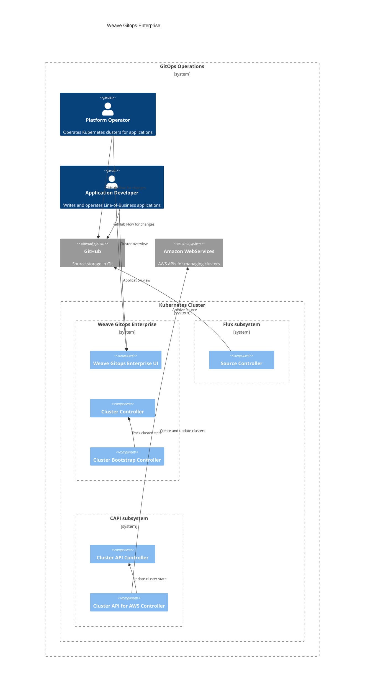

# Cluster Management 
This document outlines an architecture documentation for Weave Gitops Cluster Management domain.

## Motivation
Bringing up a new Kubernetes Cluster is fairly easy, the [IaaS providers](https://azure.microsoft.com/en-gb/resources/cloud-computing-dictionary/what-is-iaas/) provide APIs so that users can easily bring up clusters even without having to understand tools like [`kubeadm`](https://kubernetes.io/docs/setup/production-environment/tools/kubeadm/create-cluster-kubeadm/).

Preparing that cluster for workloads can require a bit more work, the Cluster Management functionality provides mechanisms for creating new [CAPI](https://cluster-api.sigs.k8s.io/) clusters from templates, bootstrapping Flux into the clusters to start loading workloads from a git repository, and installing packages of components (which we call [Profiles](https://docs.gitops.weave.works/docs/cluster-management/profiles/)) into newly bootstrapped clusters.

Our cluster-management functionality sets up a collaboration between CAPI, Flux and Helm (Profiles) for customer clusters, and provides a single-pane-of-glass view of the workloads on these clusters.

## Glossary

TBA

## Cluster Management Domains

### Cluster Domain

It is composed by the following aggregates or capabilities

**In Action**
- Available via Weave Gitops Enterprise [clusters experience](https://demo-01.wge.dev.weave.works/clusters)

**Documentation and Next Steps**
- [API](https://github.com/weaveworks/weave-gitops-enterprise/blob/main/cmd/clusters-service/api/cluster_services.proto)
- [Code](https://github.com/weaveworks/weave-gitops-enterprise)
- [User documentation](https://docs.gitops.weave.works/docs/cluster-management/intro/)
