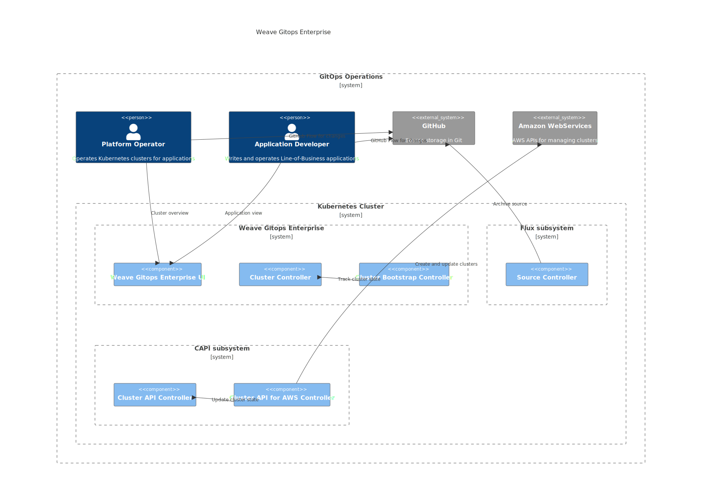
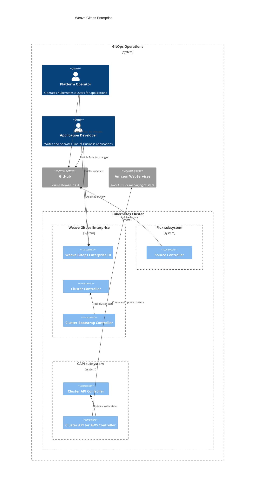

# Cluster Management 
This document outlines an architecture documentation for Weave Gitops Cluster Management domain.

## Motivation
Bringing up a new Kubernetes Cluster is fairly easy, the [IaaS providers](https://azure.microsoft.com/en-gb/resources/cloud-computing-dictionary/what-is-iaas/) provide APIs so that users can easily bring up clusters even without having to understand tools like [`kubeadm`](https://kubernetes.io/docs/setup/production-environment/tools/kubeadm/create-cluster-kubeadm/).

Preparing that cluster for workloads can require a bit more work, the Cluster Management functionality provides mechanisms for creating new [CAPI](https://cluster-api.sigs.k8s.io/) clusters from templates, bootstrapping Flux into the clusters to start loading workloads from a git repository, and installing packages of components (which we call [Profiles](https://docs.gitops.weave.works/docs/cluster-management/profiles/)) into newly bootstrapped clusters.

Our cluster-management functionality sets up a collaboration between CAPI, Flux and Helm (Profiles) for customer clusters, and provides a single-pane-of-glass view of the workloads on these clusters.

## Audience
You would be interested in know about Cluster Management Domain if
1. You are working in a capability within the domain.
2. You are working in a capability in another domain that has a dependency with it.
3. You are not working in the context of the domain nor dependent, but want to understand a bit more
of the wider weave gitops architecture.

## Glossary

- Cluster Management

## Cluster Management Architecture

Diagrams are based on [C4 Model](https://c4model.com/). Note that there are some limitations with the visualization of 
diagrams due to c4models integration with mermaid and markdown.

### Weave Gitops Enterprise - Cluster Management Domain - Context Diagram

This section shows the context where personas could make use of application delivery capabilities within weave gitops.

Its api could be found [here](https://github.com/weaveworks/weave-gitops-enterprise/blob/main/cmd/clusters-service/api/cluster_services.proto)

Next Steps:
- [code](https://github.com/weaveworks/weave-gitops-enterprise)
- [user documentation](https://docs.gitops.weave.works/docs/enterprise/intro/index.html)
