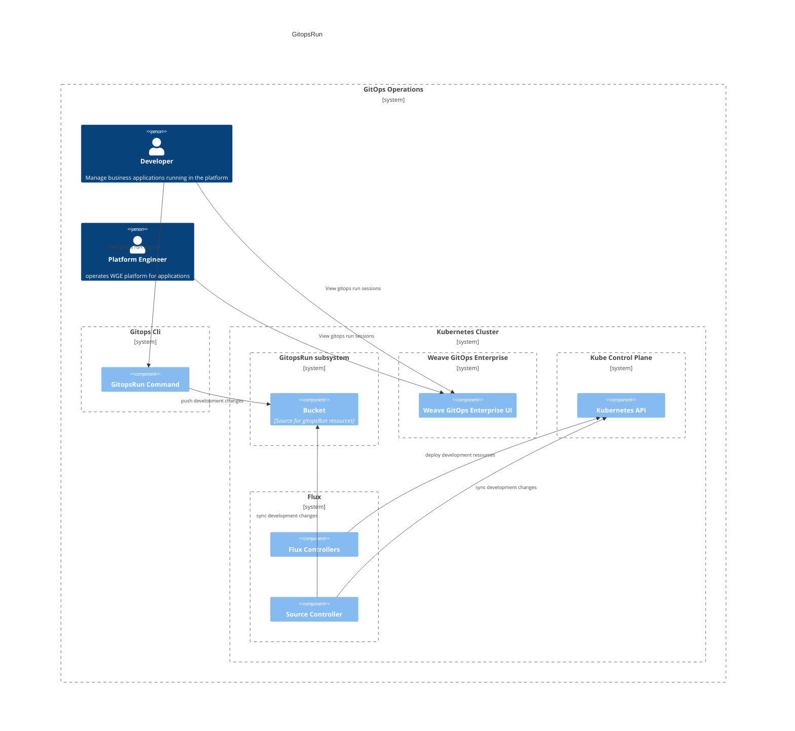

# Development Experience 
This document outlines an architecture documentation for Weave Gitops Development Experience domain

## Motivation

Development within gitops represents different challenges to traditional software development.
To reduce the adoption barriers is the problem to solve within this domain.

## Glossary

TBA 

## GitopsRun

The purpose of GitOps Run is to remove the complexity for developers so that Platform Engineers can create developer environments easily, 
and application developers can benefit from GitOps and focus on writing code.

For `gitops run` the main user flows are:
1. A developer develops apps using GitopsRun session against a local or remote cluster
2. A developer or platform engineer manages gitopsrun sessions via Weave GitOps Enterprise UI.  

**In Action**
- Available via Weave GitOps Enterprise [experience](https://demo-01.wge.dev.weave.works/gitopsrun)

**Documentation and Next Steps**
- [code](https://github.com/weaveworks/weave-gitops/tree/main/cmd/gitops/beta/run)
- [user documentation](https://docs.gitops.weave.works/docs/gitops-run/overview/)

