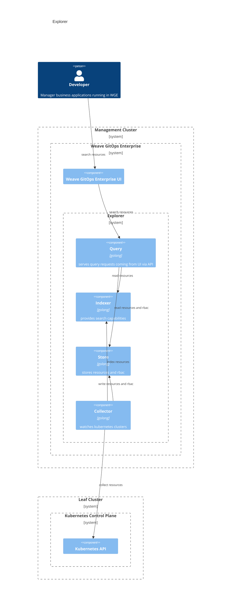

# Explore 
This document outlines an architecture documentation for Explore domain.

## Motivation

Modern applications and infrastructure presents challenges to discover and aggregate data coming from different sources.
Explore domain addresses this problem space to provide solutions that simplifies the discovery experience. 

## Explorer

Explore is the capability that allows searching across multiple infrastructure domains in a single place.

There is a single user journey:

1. As developer, I like to search for resources across my platform using [Weave Gitops UI](https://docs.gitops.weave.works/docs/explorer/getting-started/)  

There are two main components:

- Query Service: serves indexed resources to users based on their search input. 
- Collector: watches leaf cluster Kubernetes API to ingest resources and rbac into a central store for querying. 

Both journeys and components could be seen in the following diagram.

Querying flow looks like:
1. The user do a search via UI.
2. Query service receives the request via its API.
3. Retrieves the matching resources from Indexer.
4. Results are filtered via RBAC and returned to the user. 

Collecting flow looks like:
1. Collector watches clusters for connected GitOps Clusters. 
2. Watches via its Kubernetes API both supported Kind and RBAC. 
3. Store resources in Indexer. 
4. Store rbac rules in AuthzStore.

**In Action**
- Available via Weave GitOps Enterprise [experience](https://demo2.weavegitops.com/explorer/query)

**Documentation and Next Steps**
- [api](https://github.com/weaveworks/weave-gitops-enterprise/blob/main/api/query/query.proto)
- [code](https://github.com/weaveworks/weave-gitops-enterprise/tree/main/pkg/query)
- [user documentation](https://docs.gitops.weave.works/docs/explorer/intro/)
- [RFC](https://github.com/weaveworks/weave-gitops-private/tree/main/docs/rfcs/0004-query-scaling)