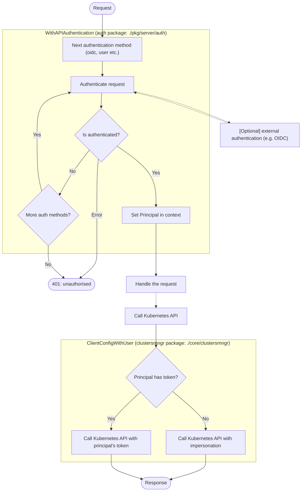
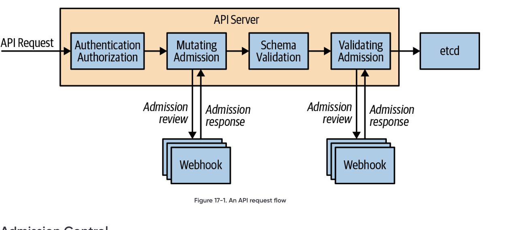

# Identity and Access Management 
This document outlines the documentation for Identity and Access Management business domain. 

## Motivation

Users want to use their existing (or new) identities to consume services and to establish access control to them.

## Glossary

* **Principal** an entity that is interacting with a system, this may be a user or an automated system
* **Authentication (AKA auth, authN)** the process of verifying who a principal is
* **Authorization (AKA authZ)** the process of determining what actions a principal is permitted to carry out (this is out of scope of this document)
* **OIDC** [OpenID Connect](https://docs.gitops.weave.works/docs/configuration/securing-access-to-the-dashboard/), a protocol that allows third-parties to authenticate end-users to an application
* **BearerToken** A token that allows direct authentication with the Kubernetes API, used in the token-passthrough authentication method

## Authentication

We have two main authentication flows:
* Authentication to the server: controls who can access the weave-gitops UI
* Authentication from the server to Kubernetes: deals with how authentication details are passed to the Kubernetes API to retrieve data.

The relationship between these two parts and their key components is given here and described below:



### Authentication to the server

Currently there are 3 supported methods:

* [OIDC (via header and cookie)](https://docs.gitops.weave.works/docs/configuration/service-account-permissions/)
* [Cluster user account](https://docs.gitops.weave.works/docs/configuration/service-account-permissions/)
* Token passthrough -- this is only used as part of enterprise installations.

methods must implement the `PrincipalGetter` interface which returns a `UserPrincipal`:
```go
type PrincipalGetter interface {
  Principal(r *http.Request) (*UserPrincipal, error)
}

type UserPrincipal struct {
  ID     string   `json:"id"`
  Groups []string `json:"groups"`
  Token  string   `json:"-"`
}
```

The `PrincipalGetter` is used by the `WithAPIAuthentication` middleware (part of the the [auth package](https://github.com/weaveworks/weave-gitops/tree/main/pkg/server/auth/auth.go)) that authenticates requests to the API. Auth methods are enabled via the `--auth-methods` flag. The methods are tested in the following order: cluster-user, token-passthrough then OIDC. The ordering is important as cluster-user and OIDC use the same name for their cookie (`id_token`) and OIDC will fail if given the cluster-user cookie. The middleware is used on all calls to the Gitops API that don't match one of the configured `PublicRoutes`. When a request is received it is passed to each enabled method's `Principal` function, the first call to return a non-nil response without erroring succeeds and no further methods are tested. If no methods succeed, or if a method returns an error, the request is rejected with a `401 (unauthorised)` status.

Configuration is primarily via the CLI but the OIDC method can also read configuration from a secret (by default `oidc-auth`) which over-rides CLI configuration. The `OIDC.TokenDuration` attribute is used to set all cookie expiry times (not just those related to OIDC).

It is important to note that the authentication method is also 'used' by the `/oauth2/userinfo` endpoint (handled by the [`login` method](https://github.com/weaveworks/weave-gitops/tree/main/pkg/server/auth/server.go). This endpoint searches cookies and headers to find principal information and returns it in an JSON object. This does not use the `PrincipalGetter` interface and discovers principal data independently.

### Authentication from the server to Kubernetes

The Gitops server's service account only needs a very limited set of permissions (`impersonate`, `get,list` on the secrets used to configure authentication and `get,list` on namespaces), the purpose of these permissions is covered in the [security docs](https://docs.gitops.weave.works/docs/configuration/service-account-permissions/). All interactions with the Kubernetes API should go via a `clustermngr` which will correctly set the Kubernetes client's impersonation configuration or bearer token (depending on the authentication method used).

The principal returned by `WithAPIAuthentication` is added to the request context to authenticate with the Kubernetes API. For OIDC and user-account methods the principal is extracted from the header or cookie token which is expected to have the following attributes:

```javascript
{
  "email": "someone@example.invalid",  // required
  "groups": ["team-a", "team-b"],      // optional
}
```

The `email` and `groups` terms are then used to configure [impersonation](https://Kubernetes.io/docs/reference/access-authn-authz/authentication/#user-impersonation) to the Kubernetes API which allows the gitops' service account to act on the user's behalf.

When token-passthrough is used the user-supplied token is treated as a bearer token and no-impersonation is carried out. It is assumed that the Kubernetes API will know how to extract any relevant Principal information from it directly.

Communication to the Kubernetes API should be done via the client returned by `GetImpersonatedClient` (part of the [clustermngr package](https://github.com/weaveworks/weave-gitops/tree/main/core/clustermngr/clustermngr.go)) which will configure impersonation.

There are a couple of places in `pkg/server/auth/` and in `cmd/gitops-server/cmd/cmd.go` where a raw (i.e. non-impersonated) client are used, this is done to read secrets during initialisation and to call the `TokenReview` APIs that authenticate with pass-through tokens.

**In Action**
- Available via Weave GitOps Enterprise [login experience](https://demo-01.wge.dev.weave.works/)

**Documentation and Next Steps**
- [code](https://github.com/weaveworks/weave-gitops/tree/main/pkg/server/auth)
- [user documentation](https://docs.gitops.weave.works/docs/configuration/securing-access-to-the-dashboard/)
- [adr](https://github.com/weaveworks/weave-gitops/blob/main/doc/adr/0015-current-api-authentication-strategy.md)

## Authorization

WGE leverages authorization to kubernetes RBAC meaning that the authorization happens at the level of the 
application underlying requests to Kubernetes. 

For example, a user going to the applications UI will request applications to Weave GitOps Enterprise that it authenticate the request
and forwards the request to Kubernetes api for serving the resources. 

To serve the request, Kubernetes executes the following flow:



[Img Source](https://www.oreilly.com/library/view/kubernetes-best-practices/9781492056461/ch17.html)

Where the first stage is Authorization (via RBAC for WGE).

**In Action**
- Available via Weave GitOps Enterprise [any resource based experience](https://demo-01.wge.dev.weave.works/)

**Documentation and Next Steps**
- [user documentation](https://docs.gitops.weave.works/docs/configuration/recommended-rbac-configuration/)