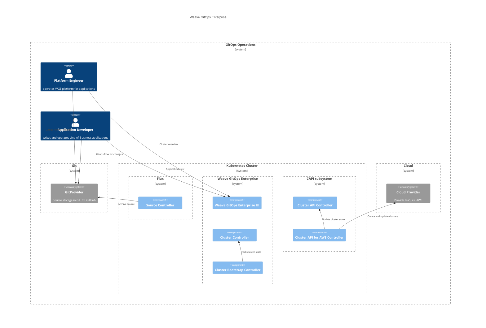
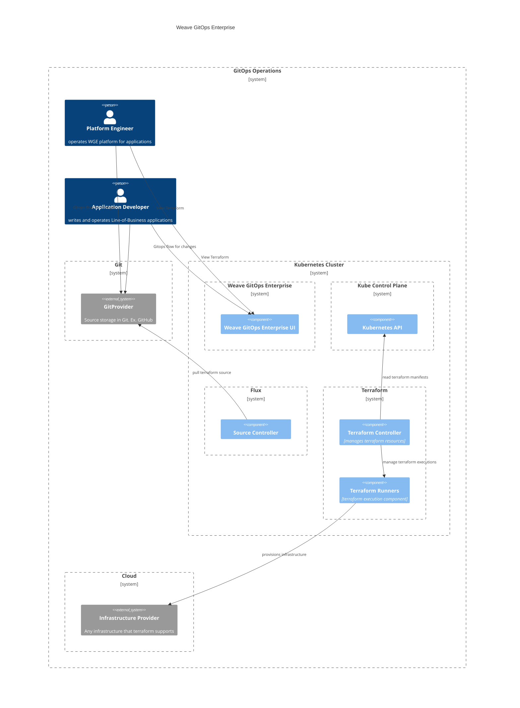

# Infrastructure 
This document outlines the architecture documentation for Infrastructure domain.

## Cluster Management

Bringing up a new Kubernetes Cluster is fairly easy, the [IaaS providers](https://azure.microsoft.com/en-gb/resources/cloud-computing-dictionary/what-is-iaas/)
provide APIs so that users can easily bring up clusters even without having to understand tools like
[`kubeadm`](https://kubernetes.io/docs/setup/production-environment/tools/kubeadm/create-cluster-kubeadm/).

Preparing that cluster for workloads can require a bit more work, the Cluster Management functionality provides
mechanisms for creating new [CAPI](https://cluster-api.sigs.k8s.io/) clusters from templates,
bootstrapping Flux into the clusters to start loading workloads from a git repository,
and installing packages of components (which we call [Profiles](https://docs.gitops.weave.works/docs/cluster-management/profiles/))
into newly bootstrapped clusters.

Our cluster-management functionality sets up a collaboration between CAPI, Flux and Helm (Profiles) for customer clusters,
and provides a single-pane-of-glass view of the workloads on these clusters.

**In Action**
- Available via Weave GitOps Enterprise [clusters experience](https://demo-01.wge.dev.weave.works/clusters)

**Documentation and Next Steps**
- [API](https://github.com/weaveworks/weave-gitops-enterprise/blob/main/cmd/clusters-service/api/cluster_services.proto)
- [Code](https://github.com/weaveworks/weave-gitops-enterprise)
- [User documentation](https://docs.gitops.weave.works/docs/cluster-management/intro/)

## Terraform

Addresses the problem of provisioning infrastructure beyond Kubernetes clusters for both platform  
and application developers. It uses Terraform as most prominent IaC solution nowadays. Leverages Weaveworks [TF-controller](https://github.com/weaveworks/tf-controller) 
to manage Terraform under Gitops principles and integrates with Weave GitOps.

Given a platform engineer or developer that wants to provision 
[Terraform infrastruture via TF-contorller](https://docs.gitops.weave.works/docs/terraform/using-terraform-cr/provision-resources-and-auto-approve/)

The common gitops flow applies:
- A PR is created to GitProvider (or other git provider) with the change.
- PR is reviewed and merged.
- Flux source controllers syncs it.
Then terraform flow kicks in:
- Terraform Controller reconciles Terraform Crs.
- Terraform Runners executes terraform jobs.
- The infrastructure is provisioned. 

**In Action**
- Available via Weave GitOps Enterprise [terraform experience](https://demo-01.wge.dev.weave.works/terraform)

**Documentation and Next Steps**
- [API](https://github.com/weaveworks/weave-gitops-enterprise/tree/main/api/terraform)
- [WGE Terraform Code](https://github.com/weaveworks/weave-gitops-enterprise/tree/main/pkg/terraform)
- [Terraform Controller Code](https://github.com/weaveworks/tf-controller)
- [User documentation](https://docs.gitops.weave.works/docs/terraform/overview/)