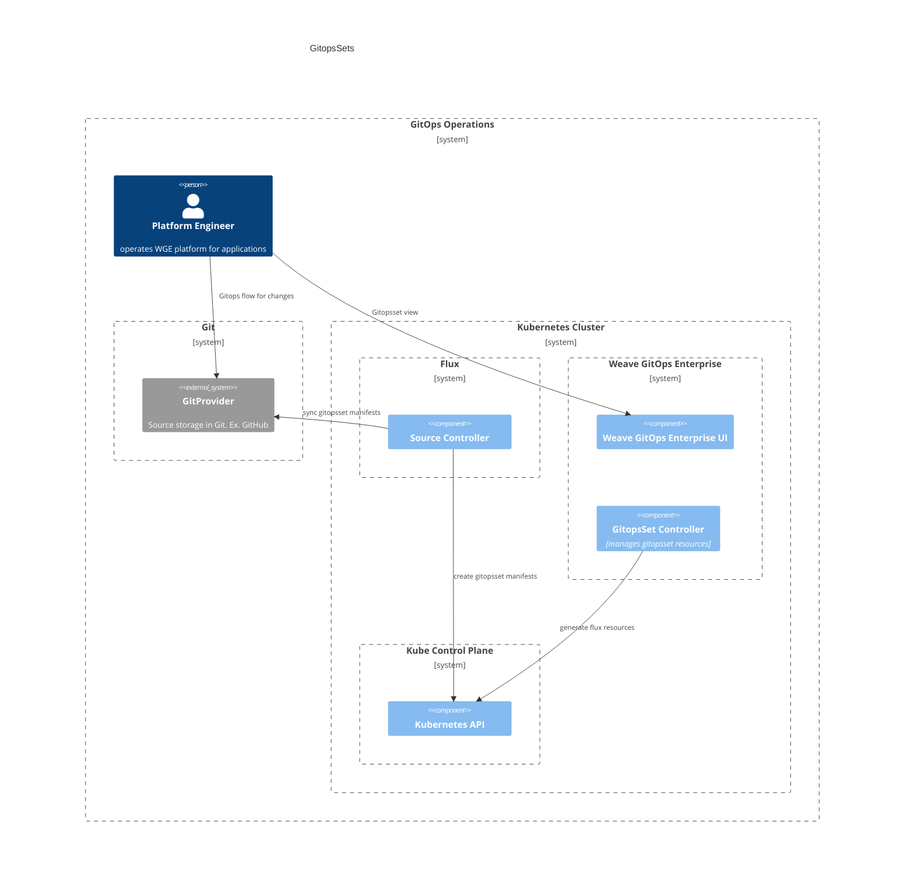
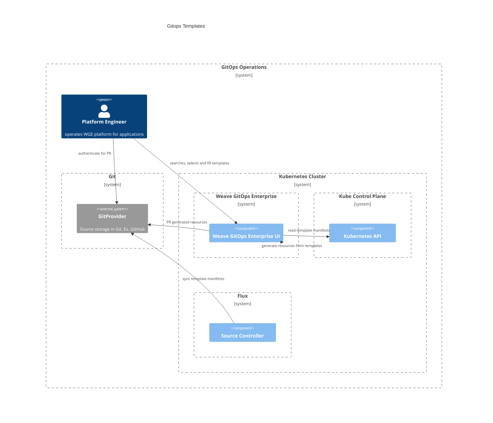
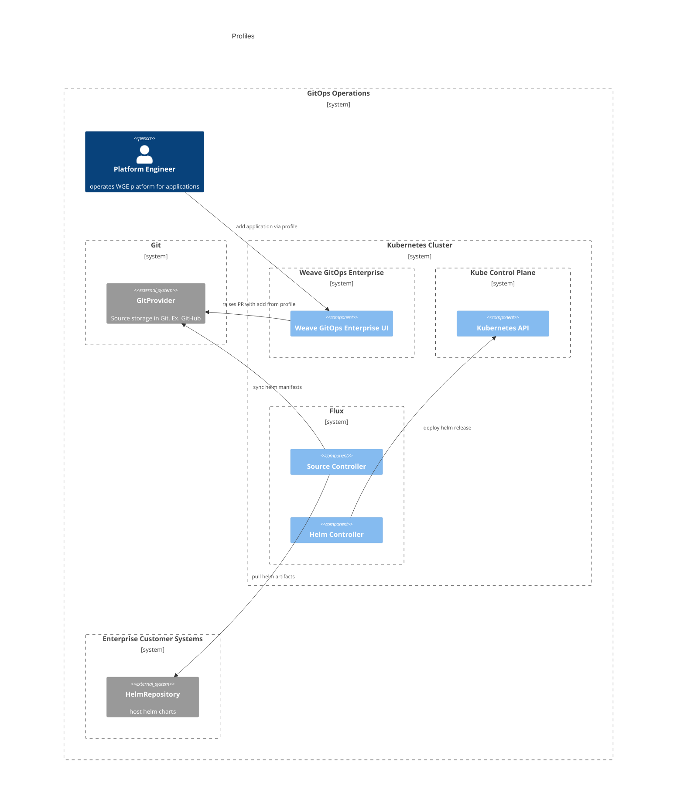

# Self-service 
This document outlines the architecture documentation for Self-service domain.

## Motivation
Bringing up a new Kubernetes Cluster is fairly easy, the [IaaS providers](https://azure.microsoft.com/en-gb/resources/cloud-computing-dictionary/what-is-iaas/) provide APIs so that users can easily bring up clusters even without having to understand tools like [`kubeadm`](https://kubernetes.io/docs/setup/production-environment/tools/kubeadm/create-cluster-kubeadm/).

Preparing that cluster for workloads can require a bit more work, the Cluster Management functionality provides mechanisms for creating new [CAPI](https://cluster-api.sigs.k8s.io/) clusters from templates, bootstrapping Flux into the clusters to start loading workloads from a git repository, and installing packages of components (which we call [Profiles](https://docs.gitops.weave.works/docs/cluster-management/profiles/)) into newly bootstrapped clusters.

Our cluster-management functionality sets up a collaboration between CAPI, Flux and Helm (Profiles) for customer clusters, and provides a single-pane-of-glass view of the workloads on these clusters.

## Glossary

TBA

## GitopsSets

GitOpsSets enable Platform Engineers to have a single definition for an application 
for multiple environments and a fleet of clusters. A single definition can be used to generate 
the environment and cluster-specific configuration.

Given a platform engineer or developer that wants to provision
[GitopsSets](https://docs.gitops.weave.works/docs/gitopssets/intro/) via [GitopsSet Controller](https://github.com/weaveworks/gitopssets-controller)

The common gitops flow applies:
- A PR is created to GitProvider (or other git provider) with the change.
- PR is reviewed and merged.
- Flux source controllers syncs it.
GitopsSet flow kicks in:
- GitopsSet Controller reconciles GitopsSet Custom Resource.
- GitopsSet Controller generate Flux resources.

**In Action**
- Available via Weave GitOps Enterprise [experience](https://demo-01.wge.dev.weave.works/gitopssets)

**Documentation and Next Steps**
- [API](https://github.com/weaveworks/weave-gitops-enterprise/tree/main/api/gitopssets)
- [WGE Code](https://github.com/weaveworks/weave-gitops-enterprise/tree/main/pkg/gitopssets)
- [Controller Code](https://github.com/weaveworks/gitopssets-controller)
- [User documentation](https://docs.gitops.weave.works/docs/gitopssets/intro/)

## Templates

GitOpsTemplates enable Application Developers to self-service components and services easily through the Weave GitOps Dashboard.

User flows are two:
1. make a template available which uses a regular gitops flow for [GitopsTemplate](https://docs.gitops.weave.works/docs/gitops-templates/creating-templates/) resource. 
2. use or update a GitopsTemplate where
   1. A platform engineering searches and select the temaplate to use via Weave Gitops UI.
   2. Fills the template and submits the template rendering request to Weave Gitops.
   3. Authenticates with GitProvider or git provider via Weave Gitops
   4. Weave GitOps creates a PR in the provider with the generated resources. 

**In Action**
- Available via Weave GitOps Enterprise [experience](https://demo-01.wge.dev.weave.works/templates)

**Documentation and Next Steps**
- [WGE Code](https://github.com/weaveworks/weave-gitops-enterprise/blob/main/cmd/gitops/pkg/templates/templates.go)
- [User documentation](https://docs.gitops.weave.works/docs/gitops-templates/intro/)

## Profiles

Profiles is the capability that allows to organise multiple Helm Charts in layers and to orchestrate them, in order 
to create a baseline platform on top of your kubernetes clusters. It also allows Platform Engineers to make 
components either optional or required to developers using self-service templates as well.

User flows are two:

1. To make a profile available which uses a regular gitops flow for [Helm Releases](https://docs.gitops.weave.works/docs/cluster-management/profiles/).
2. Add profiles to your clusters via cluster creation or [adding an application](https://docs.gitops.weave.works/docs/cluster-management/add-applications/):
   1. A platform engineering selects the profiles repository, application, layer and application values.
   2. Authenticates with GitProvider or git provider via Weave Gitops.
   3. Weave gitops creates a PR with the profile HelmRelease/HelmRepository.
   4. Source controller syncs after merge
   5. Helm Controller deploys the helm release 

**In Action**
- Available via Weave GitOps Enterprise [experience](https://demo-01.wge.dev.weave.works/applications/create)

**Documentation and Next Steps**
- [WGE Code](https://github.com/weaveworks/weave-gitops-enterprise/tree/main/pkg/services/profiles)
- [User documentation](https://docs.gitops.weave.works/docs/cluster-management/profiles)