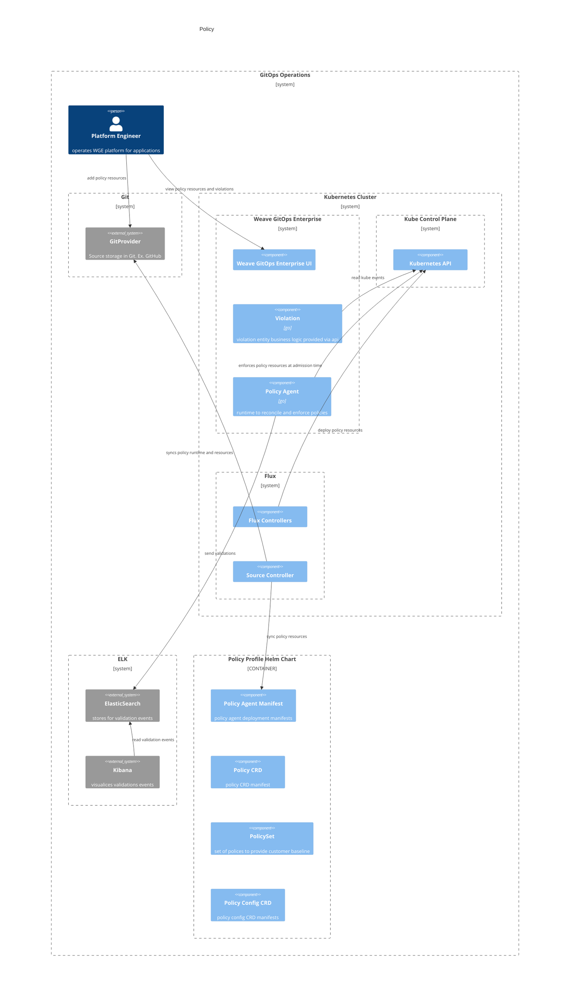
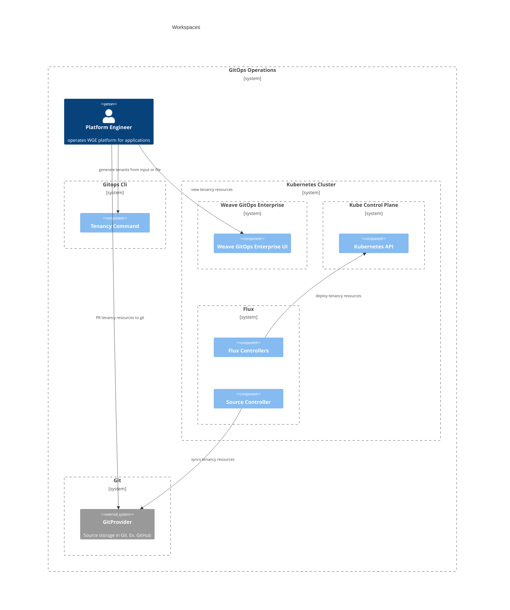

# Trusted Delivery 
This document outlines an architecture documentation for Weave Gitops Trusted Delivery domain.

## Motivation

While we want to empower developers and DevOps teams to build better software faster through our [Application Delivery](./application-delivery.md#motivation), 
we also want them to be able to do it confidently. Moving fast often means risking quality and security, and counting on humans to spot problems is often error-prone and is not scalable. 
Trusted Delivery covers this part of the value we're trying to deliver to our customers.

Trusted Delivery enables customers to use Policies to have continuous security and compliance checks across their software delivery pipeline. 
Currently, the checks can happen during 1) Commit/Build Time using our github action, 2) Runtime using our built-in admission controller 
and 3) Periodically using our audit scans.

## Glossary

- Policy
- Policy 

## Policy

Composed by the following capabilities:

- Admission: out-of-the-box admission controller that monitors any changes happening to the clusters' deployments and resources, 
  and prevents violating changes at deployment time from being deployed to clusters.
- Audit: daily scans of your clusters' deployments and resources, then report back any policy violations. 
  The audit results can be published to different data analytics tools to provide compliance posture analysis of your clusters' runtime.
- Commit/Build Time Checks: early feedback on policy violations at the commit or build time, by reporting policy violations right inside git or other CI tools. 
  This helps developers and operators detect policy violations and fix them before they deploy their changes to the clusters.

And the following flows:
1. A platform engineer via gitops flow, to provision the policy runtime and library via policy profile.
2. A platform engineer via gitops flow, add custom policies or policy config.
3. Policy runtime to enforce policies and send policy events to external system like ELK.
4. Platform engineer to view policy violations via Weave Gitops UI. 

**In Action**
- Available via Weave GitOps Enterprise [policy experience](https://demo-01.wge.dev.weave.works/policies)

**Documentation and Next Steps**
- [API](https://github.com/weaveworks/weave-gitops-enterprise/blob/main/cmd/clusters-service/api/cluster_services.proto)
- [code](https://github.com/weaveworks/weave-gitops-enterprise/blob/main/cmd/clusters-service/pkg/server/policies.go)
- [policy agent](https://github.com/weaveworks/policy-agent)
- [user documentation](https://docs.gitops.weave.works/docs/policy/intro/)

## Tenancy/Workspaces

Organizations working with Kubernetes have a tremendous need to manage tenancy for numerous software delivery teams. 
Weave GitOps Workspaces offers tenancy management for Kubernetes clusters at scale. 
Weave GitOps Workspaces, build on top of Flux's powerful approach to managing tenancy, 
and add in policies that help define finer grain rules on the tenants.

With Workspaces, Platform Engineers get to create all workspaces using one or more YAML files. 
All it takes is a single CLI command to generate all necessary YAML configuration files needed to set up the tenant as well as a list of policies that apply to each workspace and the list of repositories to which each workspace has access.

User flows are three:
   1. A platform engineer generates tenants via CLI. 
   2. A platform engineer provision tenants via gitops flow.
   3. View tenancy via Weave GitOps Enterprise UI.

**In Action**
- Available via Weave GitOps Enterprise [experience](https://demo-01.wge.dev.weave.works/workspaces)

**Documentation and Next Steps**
- [WGE Code](https://github.com/weaveworks/weave-gitops-enterprise/tree/main/cmd/gitops/app/create/tenants)
- [User documentation](https://docs.gitops.weave.works/docs/workspaces/intro/)