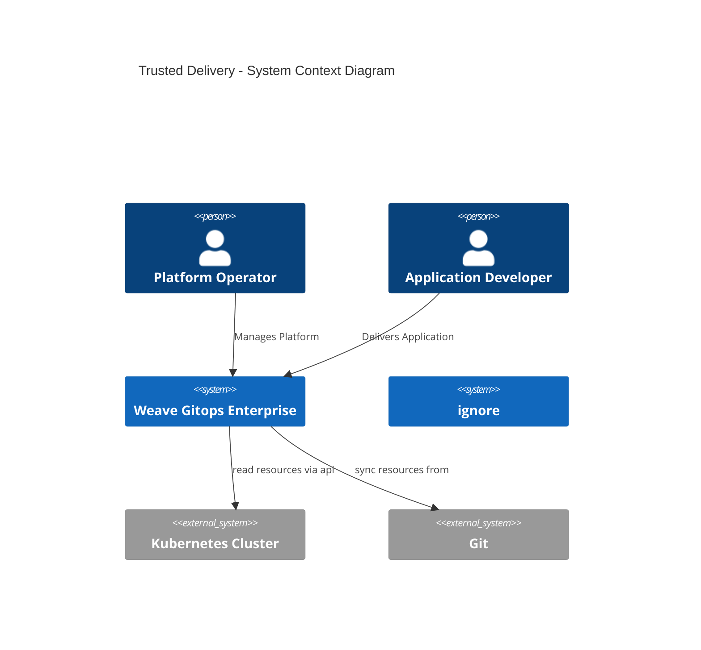
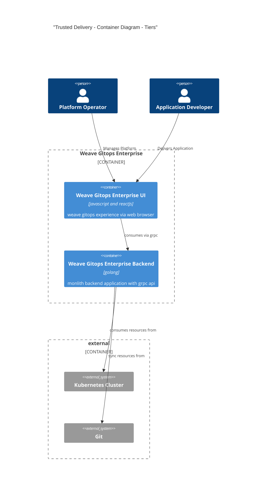
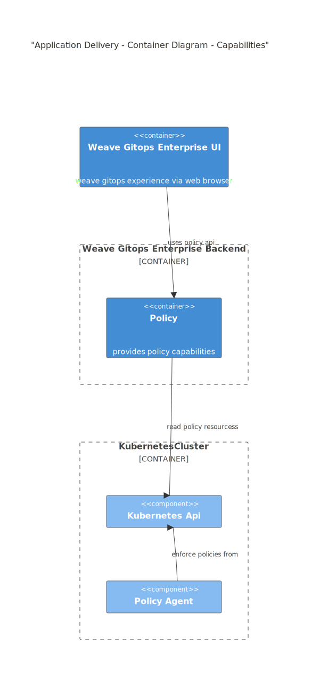
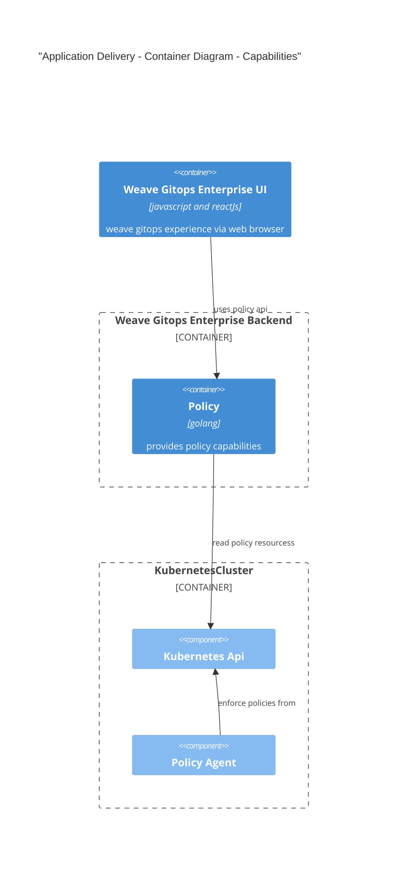

# Trusted Delivery 
This document outlines an architecture documentation for Weave Gitops Trusted Delivery domain.

## Motivation

## Audience
You would be interested in know about Trusted Delivery Domain if
1. You are working in a capability within the domain.
2. You are working in a capability in another domain that has a dependency with it.
3. You are not working in the context of the domain nor dependent, but want to understand a bit more
of the wider weave gitops architecture.

## Glossary

- Trusted Delivery
- Policy 

## Trusted Architecture

Diagrams are based on [C4 Model](https://c4model.com/). Note that there are some limitations with the visualization of 
diagrams due to c4models integration with mermaid and markdown.

### Weave Gitops Enterprise - Trusted Delivery Domain - Context Diagram

This section shows the context where personas could make use of application delivery capabilities within weave gitops.

### Weave Gitops Enterprise - Trusted Delivery Domain - Container Diagram

Weave Gitops Enterprise as tiered application that could be seen in the following diagram

### Trusted Delivery - Policy Capabilities - Component Diagram

Looking into Trusted Delivery Domain capabilities we could see the following

Its api could be found [here](https://github.com/weaveworks/policy-agent/tree/dev/api)

Next Steps:
- [code](https://github.com/weaveworks/weave-gitops-enterprise)
- [policy agent repo](https://github.com/weaveworks/policy-agent)
- [user documentation](https://docs.gitops.weave.works/docs/enterprise/intro/index.html)

