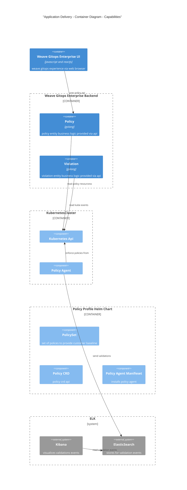

# Trusted Delivery 
This document outlines an architecture documentation for Weave Gitops Trusted Delivery domain.

## Motivation

While we want to empower developers and DevOps teams to build better software faster through our [Application Delivery](./application-delivery.md#motivation), 
we also want them to be able to do it confidently. Moving fast often means risking quality and security, and counting on humans to spot problems is often error-prone and is not scalable. 
Trusted Delivery covers this part of the value we're trying to deliver to our customers.

Trusted Delivery enables customers to use Policies to have continuous security and compliance checks across their software delivery pipeline. 
Currently, the checks can happen during 1) Commit/Build Time using our github action, 2) Runtime using our built-in admission controller 
and 3) Periodically using our audit scans.

## Glossary

- Trusted Delivery
- Policy 

## Trusted Delivery Domains

### Policy Domain

It is composed by the following aggregates or capabilities

- Policy: ability to define policies to enforce at runtime for any workload running in kubernetes. 

**In Action**
- Available via Weave Gitops Enterprise [policy experience](https://demo-01.wge.dev.weave.works/policies)

**Documentation and Next Steps**
- [API](https://github.com/weaveworks/policy-agent/tree/dev/api)
- [code](https://github.com/weaveworks/weave-gitops-enterprise)
- [policy agent repo](https://github.com/weaveworks/policy-agent)
- [user documentation](https://docs.gitops.weave.works/docs/policy/intro/)

