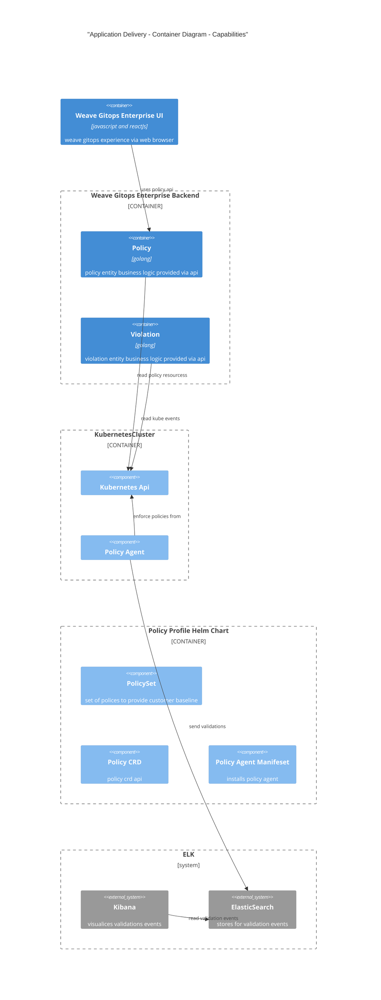

# Trusted Delivery 
This document outlines an architecture documentation for Weave Gitops Trusted Delivery domain.

## Motivation

TBA

## Glossary

- Trusted Delivery
- Policy 

## Trusted Delivery Domains

### Policy Domain

It is composed by the following aggregates or capabilities

- Policy: ability to define policies to enforce at runtime for any workload running in kubernetes. 

**In Action**
- Available via weave gitops enterprise [policy experience](https://demo-01.wge.dev.weave.works/policies)

**Documentation and Next Steps**
- [API](https://github.com/weaveworks/policy-agent/tree/dev/api)
- [code](https://github.com/weaveworks/weave-gitops-enterprise)
- [policy agent repo](https://github.com/weaveworks/policy-agent)
- [user documentation](https://docs.gitops.weave.works/docs/enterprise/intro/index.html)

