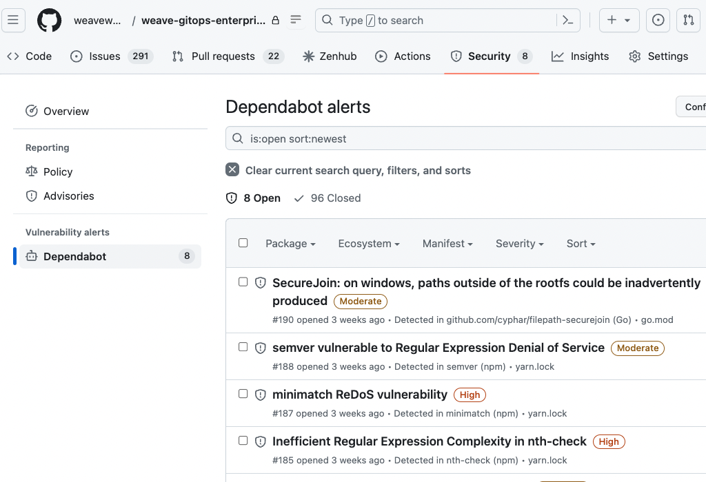

# Code Quality and Security

This doc provides an overview on the actions taken for code quality and security posture for Weave Gitops Enterprise. 

## Code

As part of CI check we run linters to ensure that code meets best practices. From [Makefile](../Makefile), the following linting target is used:

```
lint:
	bin/go-lint
	@go install github.com/yoheimuta/protolint/cmd/protolint@latest
	protolint lint -config_path=.protolint.yaml ./api ./cmd/clusters-service/api
```

We also run `unit tests` with coverage to understand the surface of code coverage. From [Makefile](../Makefile), the following target is used:

```
unit-tests-with-coverage: $(GENERATED)
	go test -v -cover -coverprofile=.coverprofile ./cmd/... ./pkg/...
	cd common && go test -v -cover -coverprofile=.coverprofile ./...
	cd cmd/clusters-service && go test -v -cover -coverprofile=.coverprofile ./...
```

An example of generate code coverage report could be see [here](resources/code-coverage-combined-test-results.xml)

We also have two other layers of testing: integration and acceptance  

Integration tests that runs as part of the regular build PR process. From [Makefile](../Makefile), the following target is used:

```
integration-tests:
	$(CURRENT_DIR)/tools/download-deps.sh $(CURRENT_DIR)/tools/test-dependencies.toml
	go test -v ./cmd/clusters-service/... -tags=integration
	go test -v ./pkg/git/... -tags=integration
	go test -v ./pkg/query/... -tags=integration
```

Acceptance tests that run on when code gets merged into main. They could be found in the 
project [test/acceptance](../test/acceptance)

## Security 

We have the following three capabilities identified:
- Dependency management 
- License checking
- Static code analysis

### Dependency Management

We use [GitHub Dependabot](https://github.com/dependabot) for vulnerability management. 
They are actively reviewed and managed via PR associated with the engineering teams. 



### License Checking

We use Fossa for doing license checking. An example of it could be seen in [Weave Gitops OSS](https://app.fossa.com/reports/005da7c4-1f10-4889-9432-8b97c2084e41) 

### Static Code Analysis 

We currently don't run static code analysis for security vulnerabilities, but plan to use [GitHub CodeQL](https://codeql.github.com/).

