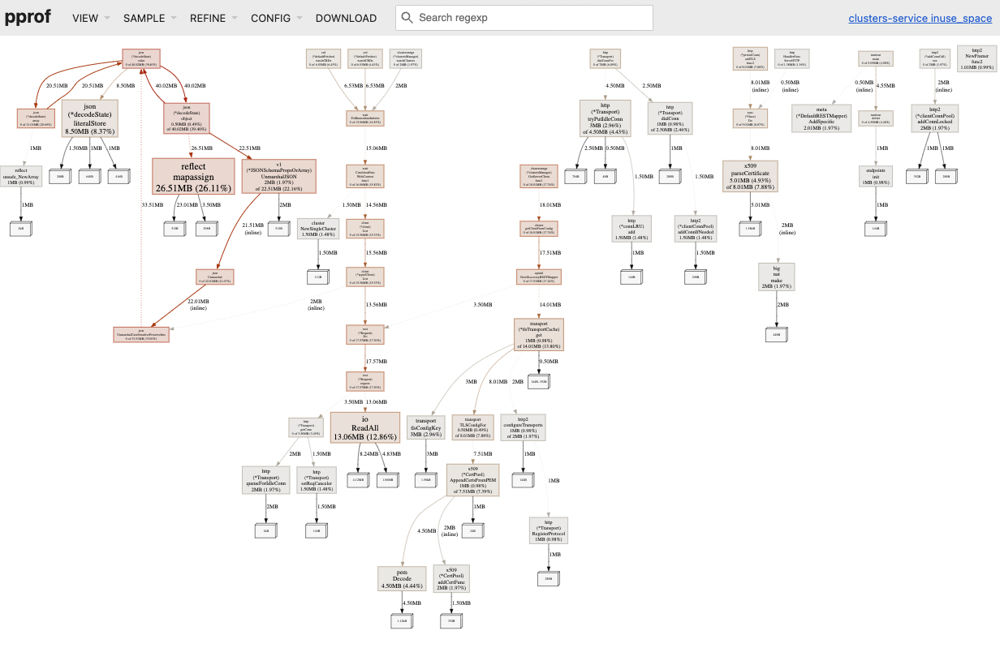
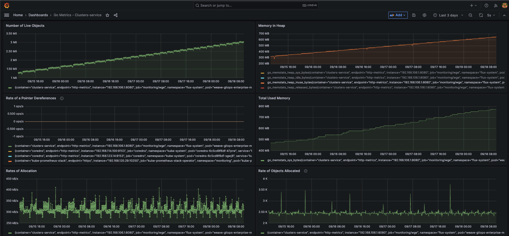

# Monitoring Performance for Weave Gitops Enterprise

This document tries to provide an overview of performance monitoring for Weave Gitops Enterprise from two angles:
- how it looks in general and 
- how it could be used for troubleshooting performance issues.

## Monitoring Overview

### Metrics

Performance monitoring for Weave Gitops Enterprise happens mostly driven by metrics. Both the management console and controllers
are instrumented to generate Prometheus metrics. In addition, given that our applications are deployed to Kubernetes, 
Kubernetes metrics for workloads are also used. In summary, we have the main three monitoring layers:

 **Go runtime metrics via [prometheus client_golang](https://github.com/prometheus/client_golang/blob/1bae6c1e6314f6a20be183a7277059630780232a/prometheus/collectors/go_collector_latest.go)**

 **API and Control Plane metrics via [go-http-metrics](https://github.com/slok/go-http-metrics) and [kubebuilder metrics](https://book.kubebuilder.io/reference/metrics-reference)**

 **Component server metrics**  
 
An example for [Explorer](https://github.com/weaveworks/weave-gitops-enterprise/blob/b643619464104e59a17e77a697cd7c290f96889a/pkg/query/collector/metrics/recorder.go) could be 
seen here:

 **Kubernetes Workload metrics**

The monitoring stack is deployed as [Flux Kustomization](https://github.com/weaveworks/weave-gitops-quickstart/tree/add-monitoring) that includes:

- Prometheus 
- Grafana
- Kubernetes Dashboards
- Flux Dashboards 
- Weave Gitops Grafana dashboards

This is included in:

- [Dev environment](../tools/dev-resources/monitoring/wge-monitoring.yaml) so it could be used during development for understanding feature performance.
- [Staging cluster](https://github.com/weaveworks/weave-gitops-clusters/tree/main/k8s/clusters/internal-dev-gke/monitoring) so it could be used to long-live monitoring a feature or the app. 

### Profiling 

Apart from metrics, Weave Gitops Enterprise leverages golang profiling capabilities [pprof](https://pkg.go.dev/runtime/pprof) 
for complementing the understanding provided via metrics. For an example on using metrics and profiling for troubleshooting 
memory leaks, see [troubleshooting performance](#troubleshooting-performance-issues).

Any environment could by profiled by enabling the configuration [`WEAVE_GITOPS_ENABLE_PROFILING`](https://github.com/weaveworks/weave-gitops-enterprise/blob/b643619464104e59a17e77a697cd7c290f96889a/cmd/clusters-service/app/server.go#L843)
that exposes an [http endpoint for pprof](https://pkg.go.dev/net/http/pprof) for any of the available profiles. 

Then it could be used remote or locally used via pprof tool. An example a memory heap dump visualised via pprof `go tool pprof -http=:8082 heap` could be:

Profiling is enabled by default in [dev via Tilt](../tools/dev-values.yaml) 

## Troubleshooting Performance Issues

As developer, we build up features that requires compute resources. Apart from functional requirements, we
expect to behave in en efficient way in terms of performance and compute resources usage.

This section guides you on an approach that could be useful to determine performance issues. In particular, we are going 
to focus on memory leaks as an example based on the experience gathered out of [this issue](https://github.com/weaveworks/weave-gitops-enterprise/issues/3189).

### Setup

- An instance of Weave Gitops Enterprise with Monitoring stack deployed.
- The monitoring stack deployed [Flux Kustomization](https://github.com/weaveworks/weave-gitops-quickstart/tree/add-monitoring) that includes:
- Enabled [metrics](https://docs.gitops.weave.works/docs/references/helm-reference/) 
- Enabled [profiling](https://github.com/weaveworks/weave-gitops-enterprise/blob/b643619464104e59a17e77a697cd7c290f96889a/cmd/clusters-service/app/server.go#L843)

### Detect memory leaks

There could be different ways to detect that you might be facing a memory leak. One of them could have an ever-growing 
memory usage for you container as shown by the following picture:

At this point you determine how you memory heap looks like following these steps:

1. Download a heap dump for weave gitops by adding `/debug/pprof/heap` to your WGE URL (For example https://wge-3189-fix.eng-sandbox.weave.works/debug/pprof/heap).
2. Start pprof web interface by `go tool pprof -http=:8082 heap`
3. Navigate to your browser http://localhost:8082/ui/ and the UI will open like the following  

Use the pprof view that better helps you understand these two questions:

 1. What is the function that is generating objects for the heap that are not freed?
 2. What is the call chain that ends up calling the function?

For example, 

The following `inuse_objects` tell us that the 22% of objects are being generated from `GetServerClient`
where we expected that server connections were cached. 

which indicate that we had an issue around that feature. 

Once we identified the issue with the [cache](https://github.com/weaveworks/weave-gitops/commit/c6cc497d3c09bcadf019236ec2be8cb08b7e7d02)
and released the change, we could monitor the impact in the dashboard:

Where we could see how the memory used and the heap flatten as a result of the change. 

These steps could require iteration until the cause is found and addressed.

