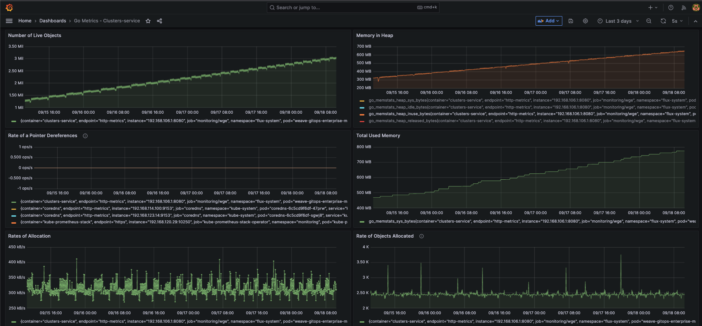

# Detecting resource leaks for Weave Gitops

## Motivation

As developer, we build up features that requires compute resources. Apart from funcional requirements, we 
expect to behave in en efficient way in terms of performance and compute resources usage. 

This document guides you on an approach that could be useful to determine resource leaks for Weave Gitops. It is based
on the experience of doing so in the context of [this issue](https://github.com/weaveworks/weave-gitops-enterprise/issues/3189).

## Requirements

- An instance of Weave Gitops Enterprise with  
- Enabled [metrics]() 
- Enabled [profiling](https://go.dev/blog/pprof) pprof 
- An instance of Prometheus and Grafana https://github.com/weaveworks/weave-gitops-quickstart/tree/add-monitoring/monitoring  
- These Grafana [dashboards](./dashboards)  

## Detect memory leaks

There could be different ways to detect that you might be facing a memory leak. One of them could have an ever-growing 
memory usage for you container as shown by the following picture:

At this point you determine how you memory heap looks like via

1. Download a heap dump for weave gitops by adding `/debug/pprof/heap` to your WGE url (For exampleh ttps://wge-3189-fix.eng-sandbox.weave.works/debug/pprof/heap).
2. Start pprof web interface by `go tool pprof -http=:8082 heap`
3. Navigate to your browser http://localhost:8082/ui/ and a UI like 

4. Use the pprof view that better helps you understand these two questions:
 a) what is the function that is generating objects for the heap that are not freed
 b) what is the call chain that ends up calling the function

