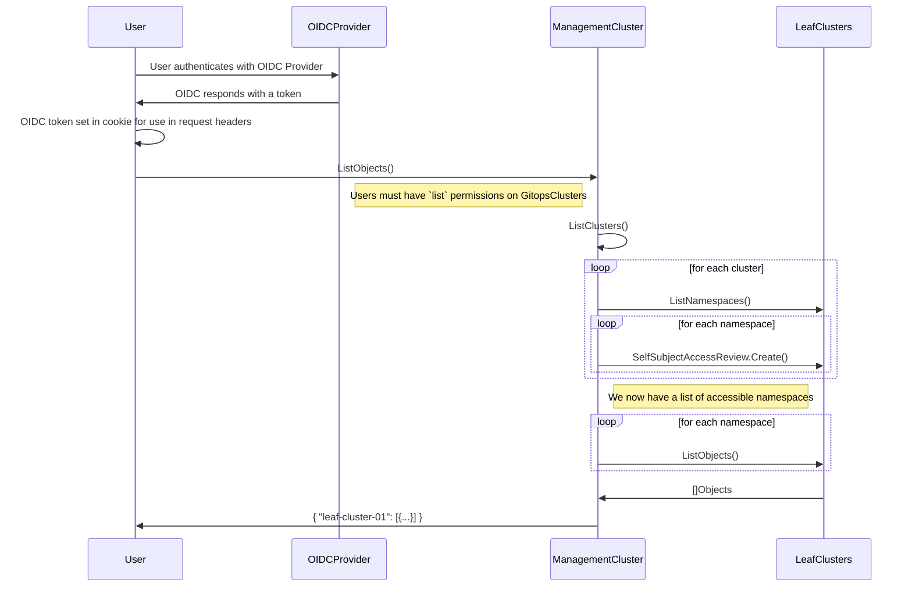

```mermaid
sequenceDiagram
participant User
participant OIDCProvider
participant ManagementCluster

User->>OIDCProvider:User authenticates with OIDC Provider
OIDCProvider->>User:OIDC responds with a token
User->>User:OIDC token set in cookie for use in request headers
User->>ManagementCluster:ListObjects()
Note left of ManagementCluster:Users must have `list` permissions on GitopsClusters
ManagementCluster->>ManagementCluster:ListClusters()

loop for each cluster
    ManagementCluster->>LeafClusters:ListNamespaces()
    loop for each namespace
        ManagementCluster->>LeafClusters:SelfSubjectAccessReview.Create()
    end
end
Note right of ManagementCluster: We now have a list of accessible namespaces
loop for each namespace
    ManagementCluster->>LeafClusters:ListObjects()
end
LeafClusters->>ManagementCluster:[]Objects
ManagementCluster->>User:{ "leaf-cluster-01": [{...}] }
```
