# Documenting the Effects of Policy Configurations on Different Apps

This document outlines the step-by-step process for demonstrating how policy configurations affect different applications. In this scenario, we create a tenant and three different applications through kustomization with identical settings. These applications will have different interactions with the policy configurations.

## Prerequisites

- Install some policies using [this](https://github.com/weaveworks/policy-agent/blob/dev/docs/getting-started.md#installing-policies) guide.
- On this demo we will use the `ControllerMinimumReplicaCount`, which violates if the desiried app deployment is lower than the policy value.

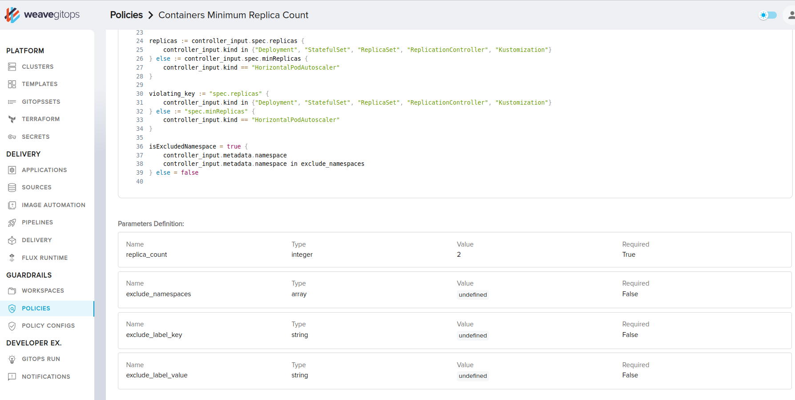


## Step 1: Create the Tenant

The first step is to create the tenant. This is done by creating a namespace and service account for the tenant, and granting it specific roles and permissions.


<details>
  <summary>dev-tenant.yaml - Click to expand .. </summary>

```yaml
apiVersion: v1
kind: Namespace
metadata:
  creationTimestamp: null
  labels:
    toolkit.fluxcd.io/tenant: dev-tenant
  name: dev-ns
spec: {}
status: {}
---
apiVersion: v1
kind: ServiceAccount
metadata:
  creationTimestamp: null
  labels:
    toolkit.fluxcd.io/tenant: dev-tenant
  name: dev-tenant
  namespace: dev-ns
---
apiVersion: rbac.authorization.k8s.io/v1
kind: Role
metadata:
  creationTimestamp: null
  labels:
    toolkit.fluxcd.io/tenant: dev-tenant
  name: dev-tenant-service-account
  namespace: dev-ns
rules:
- apiGroups:
  - ""
  resources:
  - namespaces
  - pods
  verbs:
  - list
  - get
---
apiVersion: rbac.authorization.k8s.io/v1
kind: RoleBinding
metadata:
  creationTimestamp: null
  labels:
    toolkit.fluxcd.io/tenant: dev-tenant
  name: dev-tenant-service-account
  namespace: dev-ns
roleRef:
  apiGroup: rbac.authorization.k8s.io
  kind: Role
  name: dev-tenant-service-account
subjects:
- kind: ServiceAccount
  name: dev-tenant
  namespace: dev-ns
```
</details>

```bash
gitops create tenants --from-file dev-tenant.yaml
```

Navigate to workspaces list, it should looks like below.
 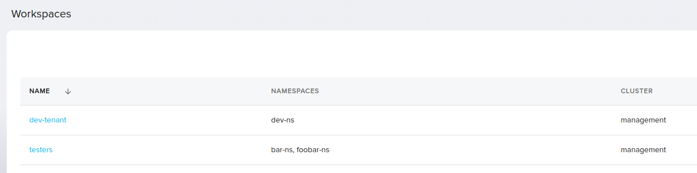


## Step 2: Create Applications with Kustomization

Next, create three applications from kustomization using identical settings.

  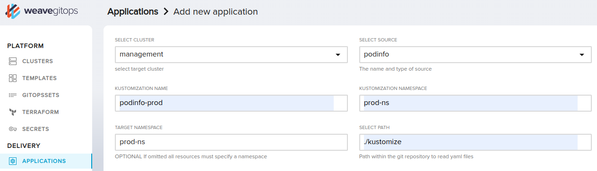

  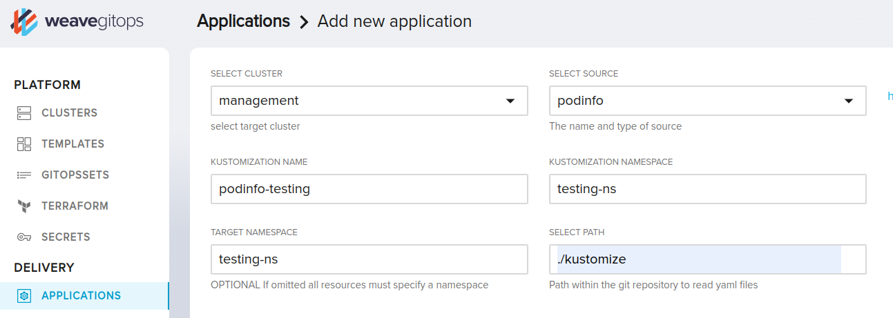

  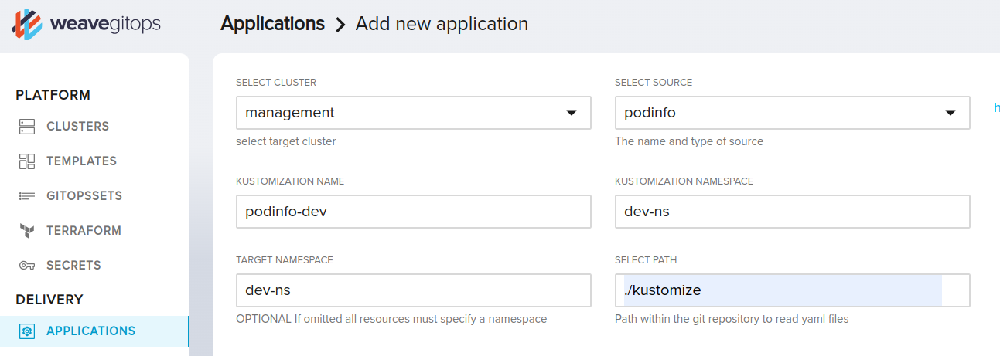

And add a label `toolkit.fluxcd.io/tenant: dev-tenant` to the `podinfo-dev` application so it should be under the `dev-tenant` workspace. The `podinfo-dev` application yaml resource should looks like below example.

<details>
  <summary>podinfo-dev.yaml - Click to expand .. </summary>

```yaml
apiVersion: kustomize.toolkit.fluxcd.io/v1beta2
kind: Kustomization
metadata:
  creationTimestamp: null
  name: podinfo-dev
  namespace: dev-ns
  labels:
    toolkit.fluxcd.io/tenant: dev-tenant
spec:
  interval: 10m0s
  path: ./kustomize
  prune: true
  sourceRef:
    kind: GitRepository
    name: podinfo
    namespace: apps
  targetNamespace: dev-ns
```
</details>

And after this step the `Applications` list page should have the three apps looks like below.
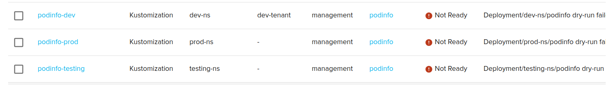

And the details of anyone of the three apps will have a violation mention that the deployment replicas is 1 and the minimum must be 2 at least.
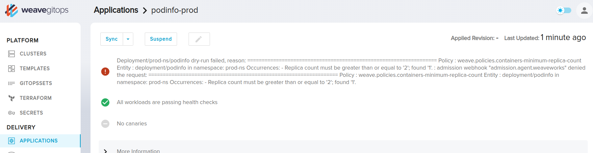.

## Step 3: Create the PolicyConfigs

Now let's add two policyConfigs.

A policyConfig for `podinfo-prod` application to make sure it will have at least `5` replicas.
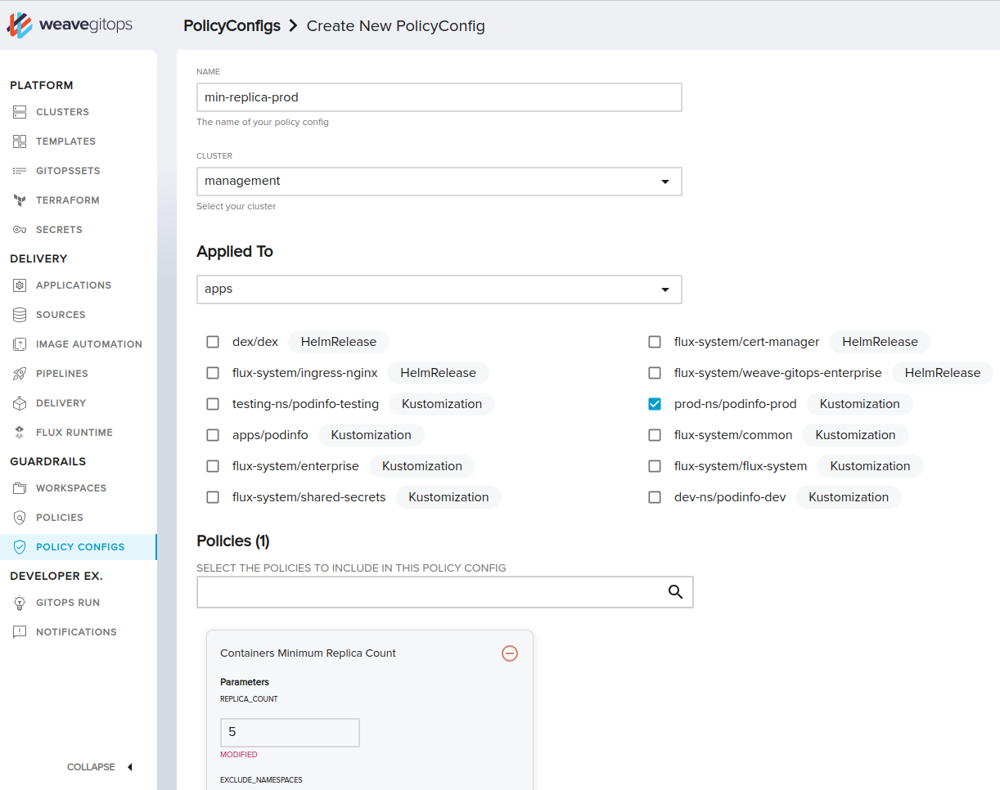

A policyConfig for `dev-tenant` work space to allow any app under this workspace to have only `1` replica and pass the `ControllerMinimumReplicaCount` requirements.
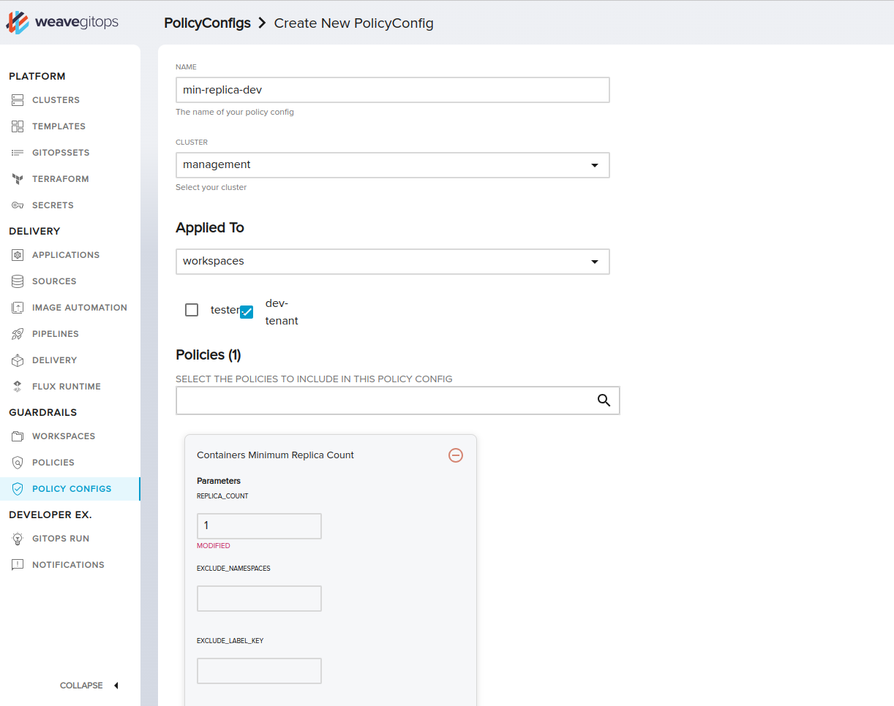

Now the `PolicyConfig` page should have two items on the list.
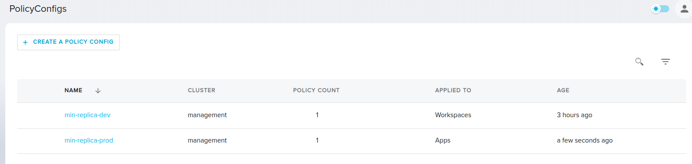.

## Step 4: Show the effect on Applications

Now let's see the effect of the created PolicyConfigs on the Apps.

First, the `podinfo-testing` should still the same violation message affected by the original `ControllerMinimumReplicaCount` policy with `min` 2 replicas.
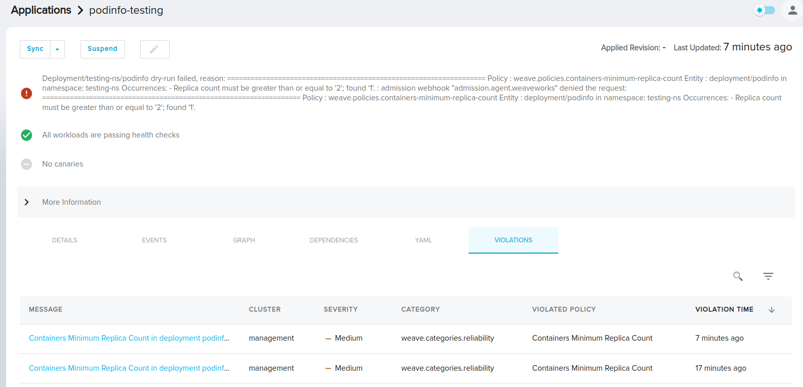
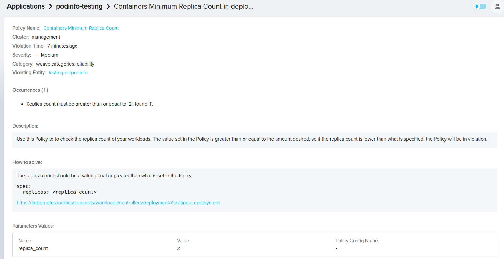

The `podinfo-prod` app should be affected now by the PolicyConfig we have created earlier `min-replica-prod` with the new `min` replicas values `5`.
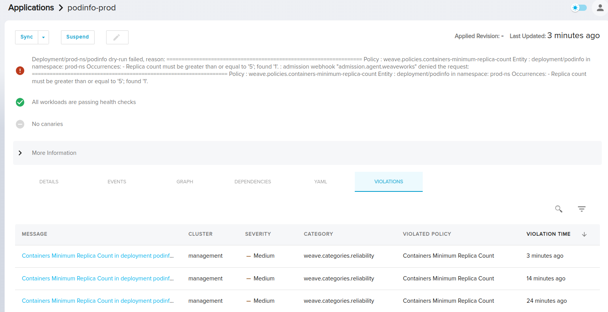
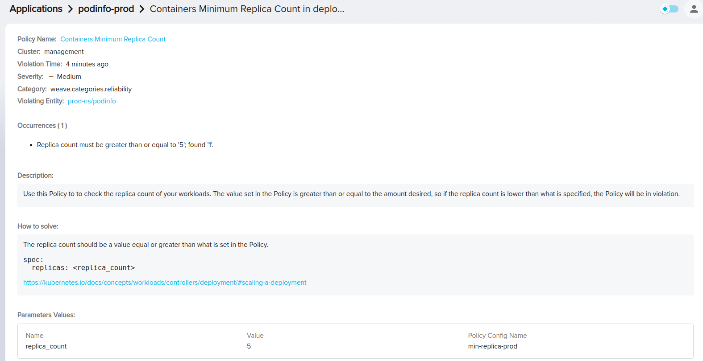

The `podinfo-dev` app should be affected now by the PolicyConfig we have created earlier `min-replica-dev` for the whole workspace `dev-tenant` with the new `min` replicas values `1` and should be deplooyed successfully without any violations.
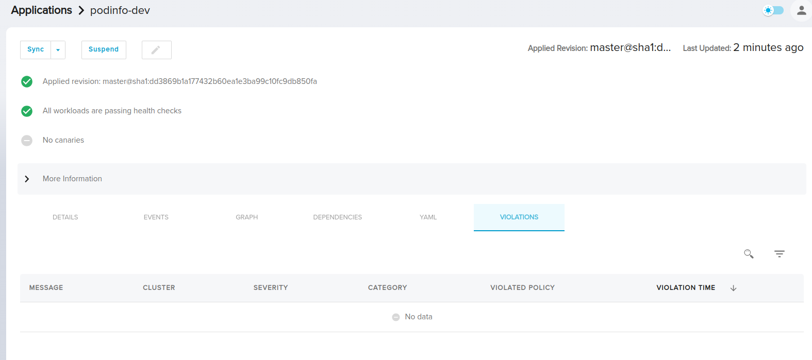

## Tear down

Remove the `policy-configs` directory from the remote repository.

Remove the three Apps kustomization from the repository.

Delete the `dev-tenant.yaml` file content which we have used on creating the Workspace, and run the same command again.

```bash
gitops create tenants --from-file dev-tenant.yaml
```
